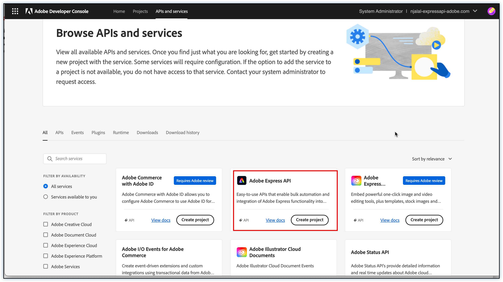
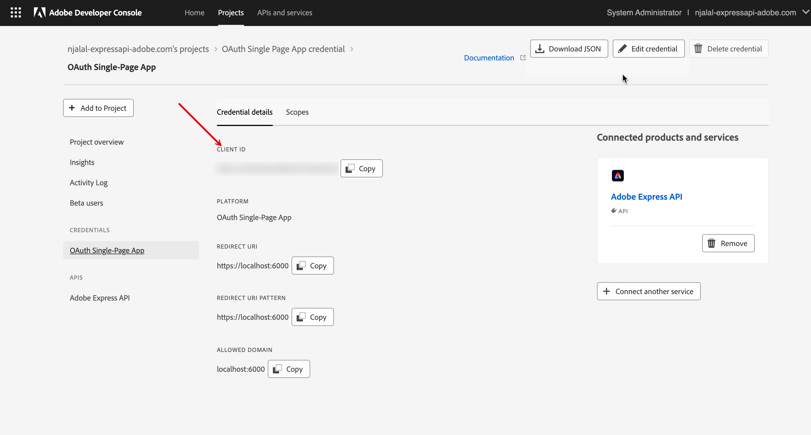
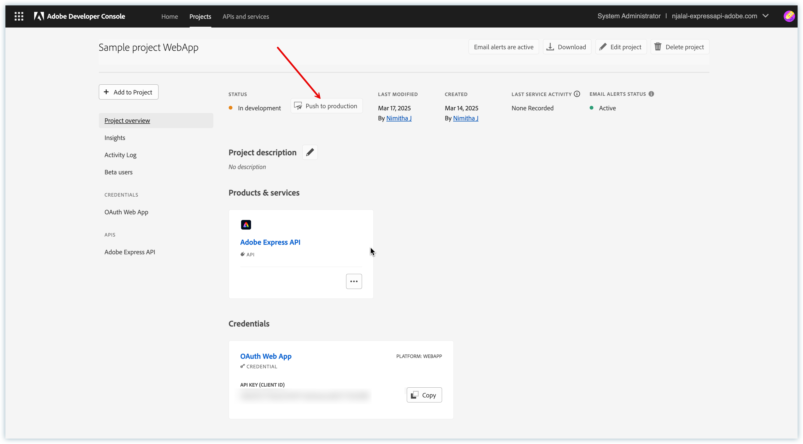
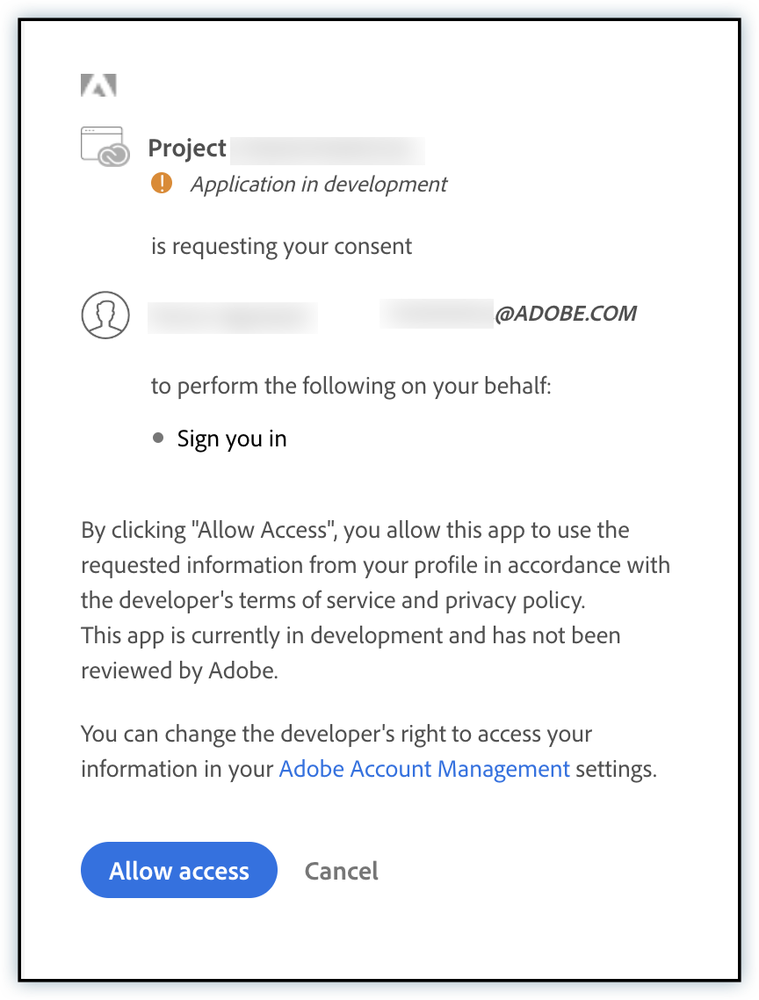

# Create Credentials

<InlineAlert variant="warning" slots="text" />

This guide is for admins creating a client ID (API key) and client secret for their teams. If you are a developer and your admin has already shared a valid client ID and secret with you, head over to the [Authentication](../index.md) guide.

## Before you begin

By the end of this guide you will have:

- Chosen the authentication type that matches your application architecture.
- Created a project in Adobe Developer Console with the Adobe Express API added.
- Generated the client ID (API key) and, where applicable, the client secret needed to call the Adobe Express API.

## Choose an authentication type

Adobe Express API supports three authentication flows. Pick the one that matches how and where your application runs.

| Flow                            | Best for                                          | Needs a client secret?      | Calls run as      |
| ------------------------------- | ------------------------------------------------- | --------------------------- | ----------------- |
| **Server-to-Server**            | Backend integrations acting for your organization | Yes (stored on your server) | Technical account |
| **OAuth Web App**               | Web apps with a frontend **and** a backend server | Yes (stored on your server) | End user          |
| **OAuth Single-page App (SPA)** | Browser-only apps with no backend                 | No (uses PKCE)              | End user          |

Learn more about [authentication](https://developer.adobe.com/developer-console/docs/guides/authentication/UserAuthentication/) in the Adobe Developer Console docs.

## Set up your project

Complete these steps once, regardless of which authentication flow you use. You'll configure the flow-specific credential in the next section.

**1. Log in to the Adobe Developer Console**

Sign in at [Adobe Developer Console](https://developer.adobe.com/console/home), open the **APIs & Services** catalog, and locate **Adobe Express API**.

**2. Create a new project**

On the Adobe Express API product card, click **Create project**.

_Adobe Express API product card in the Developer Console_

**3. Register your project name**

Give the project a recognizable name so you can find it later in the Developer Console. You can change this name at any time.

Next, configure credentials for your chosen authentication flow.

## Configure credentials

<InlineAlert variant="info" slots="text" />

To call the Adobe Express API, developers need a valid client ID (API key) and an access token.

### Server-to-Server

Server-to-Server authentication lets your backend generate access tokens and call Adobe APIs on behalf of your organization using the OAuth 2.0 `client_credentials` grant. The steps below follow the same Developer Console pattern used across Firefly Services APIs. For the full walkthrough—including console access, scopes, and sample token requests—see [Getting started with Adobe Firefly Services](https://developer.adobe.com/firefly-services/docs/guides/get-started/).

**1. Add the Adobe Express API**

- In your project, click **Add API** and select **Adobe Express API**.
- When prompted for a credential type, keep **OAuth Server-to-Server**, name the credential, and continue.

**2. Assign product profiles**

Select the product profiles your admin assigned for Express. These control what the credential can access in your organization.

**3. Save and retrieve credentials**

Click **Save configured API**. On the credential overview, copy your **client ID (API key)** and **client secret**, and note the **technical account email**—you'll need it for document and asset access.

_Server-to-Server credentials overview showing client ID (API key) and technical account email_

**4. Generate access tokens**

Use the token endpoint and scopes for your credential (see **Generate access token** in the [Firefly Services getting started](https://developer.adobe.com/firefly-services/docs/guides/get-started/) guide linked above). When calling Express API, send the token and client ID as described in [Authentication – Call the Express API](../index.md#call-the-express-api). Store your client secret only on the server.

**5. Grant the technical account access to documents and assets**

API calls run as the **technical account** tied to your OAuth Server-to-Server credential—not as an end user. Anything your integration must read or edit (templates, Express documents, cloud assets) must be reachable by that technical account.

| Approach                             | When to use                                                                                                                                                                                                                                                                                                                                                                                                                                                                                                                                                                                                              |
| ------------------------------------ | ------------------------------------------------------------------------------------------------------------------------------------------------------------------------------------------------------------------------------------------------------------------------------------------------------------------------------------------------------------------------------------------------------------------------------------------------------------------------------------------------------------------------------------------------------------------------------------------------------------------------ |
| **Share in Express**                 | You need access to specific Express documents or projects. Open the share experience for the doc or project, paste the **technical account email** from the credential overview into the share field, and grant at least **Can edit** (or the minimum permission your workflow needs). This is the most direct way to give the technical account access to a given asset.                                                                                                                                                                                                                                                |
| **Storage administrator (org-wide)** | You need the technical account to work across Adobe cloud storage in your organization (for example, broader asset management). In [Adobe Admin Console](https://adminconsole.adobe.com/), an org administrator must grant the technical account **Storage administrator** and ensure it has a product license that includes Enterprise Storage where required. Follow [Technical account setup for Adobe Cloud Storage](https://developer.adobe.com/cloud-storage/guides/getting-started/technical-account-setup)—including verifying the identity is a **Technical Account** (Enterprise ID), not a personal Adobe ID. |

If documents or assets are still inaccessible, confirm sharing with the technical account email, product profile assignment in Developer Console, and (for cloud storage) Storage administrator assignment and Enterprise Storage licensing per the guide above.

### OAuth Web App

OAuth Web App authentication is ideal for applications with both frontend and backend components. This method uses the OAuth 2.0 `authorization_code` grant type to obtain an access token on behalf of the user.

**1. Add the Adobe Express API**

- In your project, click **Add API** and select **Adobe Express API**.
- Choose **OAuth Web App** as the authentication method.

**2. Configure redirect URIs**

Provide a **Default Redirect URI** and a **Redirect URI pattern**. These are the URLs where Adobe will redirect users after they authorize your application.

**3. Save and retrieve credentials**

- Click **Save configured API**.
- On the credential overview you'll see the **client ID (API key)**.
- Select **OAuth Web App** from the left navigation to view or retrieve your **client secret**.

_OAuth Web App credentials overview showing client ID (API key) and secret retrieval_

**4. Manage beta access**

- For projects in beta, add the users who can access your application.
- In your project, navigate to **Credentials > OAuth Web App > Beta users**.
- Add the email addresses of users who should have access. It may take a few minutes for beta user access to sync.

**5. Use the client ID and client secret**

- Authenticate requests using the client ID (API key) and client secret from the credential overview.
- Store the client secret only on your backend server and fetch tokens from there, so credentials are never exposed in the frontend.
- For end-to-end guidance, see the [OAuth Web App implementation guide](https://developer.adobe.com/developer-console/docs/guides/authentication/UserAuthentication/implementation#oauth-web-app-credential).

### OAuth Single-page App

OAuth Single-page App authentication is designed for JavaScript applications that run entirely in the browser. This method uses the OAuth 2.0 PKCE (Proof Key for Code Exchange) flow to obtain tokens securely without requiring a client secret.

**1. Add the Adobe Express API**

- In your project, click **Add API** and select **Adobe Express API**.
- Choose **OAuth Single-page App** as the authentication method.

**2. Configure redirect URIs**

Provide a **Default Redirect URI** and a **Redirect URI pattern**. These are the URLs where Adobe will redirect users after they authorize your application.

**3. Save and retrieve the client ID**

Click **Save configured API**. On the next screen you'll see your **client ID (API key)**. No client secret is issued for SPA credentials.

_OAuth SPA credentials overview showing client ID (API key)_

**4. Manage beta access**

- For projects in beta, add the users who can access your application.
- In your project, navigate to **Credentials > OAuth Single-page App > Beta users**.
- Add the email addresses of users who should have access. It may take a few minutes for beta user access to sync.

**5. Use the client ID with the PKCE flow**

- Authenticate requests using the client ID (API key) from the credential overview.
- Implement the [OAuth 2.0 PKCE](https://oauth.net/2/pkce/) flow in your frontend for secure token generation—no client secret is needed, as authentication happens directly in the browser.
- For end-to-end guidance, see the [OAuth Single-page App implementation guide](https://developer.adobe.com/developer-console/docs/guides/authentication/UserAuthentication/implementation#oauth-single-page-app-credential).

**6. Push to production**

<InlineAlert variant="warning" slots="text" />

Once you push a Single-page App project to production, you cannot move it back into development. Your app will be open to everyone and the beta users list will no longer apply.

When you finish development, click **Push to production**.

_Project overview showing push to production button_

## User consent flow

When users authenticate through OAuth Web App or OAuth Single-page App, they see a consent screen. Users must click **Allow Access** to grant the requested permissions.

_Example of the OAuth consent screen shown to users_
