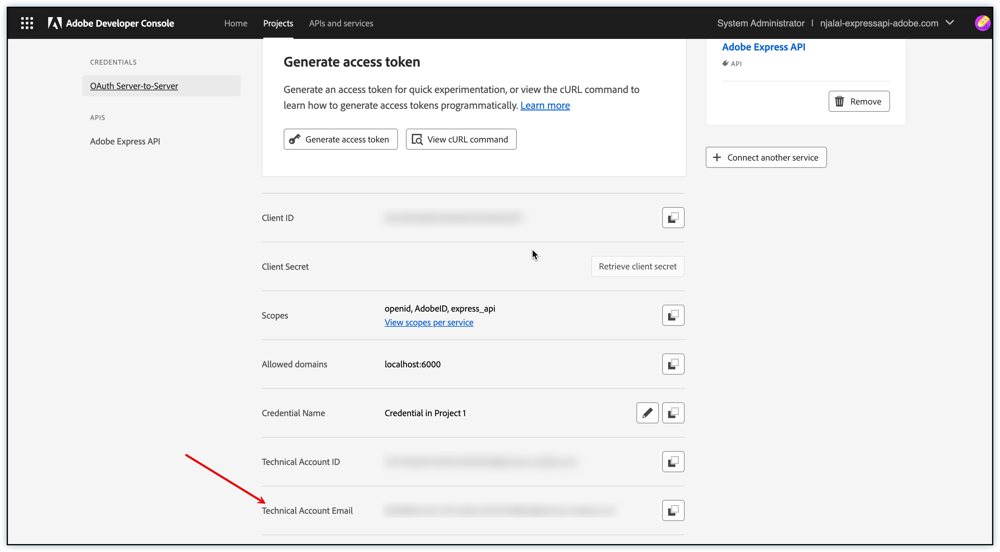
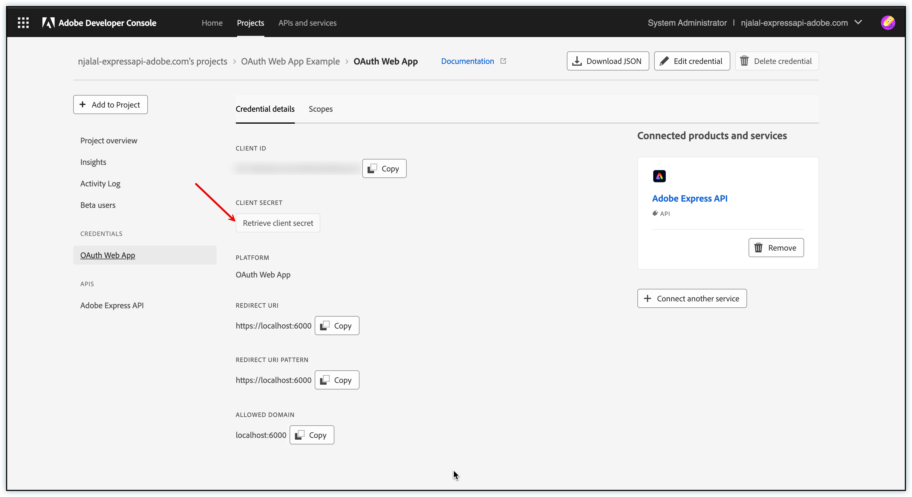

# [Admins only] Create Credentials

<InlineAlert variant="warning" slots="text" />

This guide contains instructions for admins on creating client ID (API key) and Client secrets for their teams. If you are a developer and your admin has shared a valid API Key with you, head over to the [Authentication](../authentication/) guide.

## Overview

This guide will help you:

1. Choose the appropriate authentication flow for your application
2. Create API keys (client ID) and client secrets in the Adobe Developer Console to start using the Adobe Express API

Adobe Express API supports multiple ways of user authentication. Based on the authentication type chosen by your admin, follow the corresponding section in this guide to set up your credentials.

## Choose Authentication Type

<!--
### Server-to-Server Authentication

Authenticate an application running on your backend server to call Adobe APIs on behalf of your organization.
-->

**User Authentication**

Authenticate an Adobe user to call Adobe APIs on their behalf. The Adobe user must sign in and consent to your application before it can view or edit their data. Learn more on [how to implement](https://developer.adobe.com/developer-console/docs/guides/authentication/UserAuthentication/) user authentication.

In user authentication, there are two options:

### OAuth WebApp

Compatible with applications that have a frontend UI and a backend server. The server is responsible for storing client secrets securely and fetching access tokens.

### OAuth Single-page App (SPA)

Compatible with web applications running in a browser without a backend server. The web application is responsible for fetching access tokens.

## Create API keys (client ID) and client secret

### Access Adobe Developer Console

- Login to [Adobe Developer Console](https://developer.adobe.com/console/home)
- Navigate to the **API and services** section. Search for **Express API**.

### Create a New Project

Once you see the Adobe Express API product card, click the **Create project** button.

*Adobe Express API product card in the Developer Console*

**Register Your Project Name**:

Start by registering your project name. This will help you find your project in the Developer Console later, and you can modify this name later.

**To make calls to the Adobe Express API, developers need a valid client ID (API key) and an access token**.

<!--
#### Server-to-Server Authentication

Server-to-server authentication allows your application's server to generate access tokens and make API calls on your application's behalf. This method uses the OAuth 2.0 client_credentials grant type.

**Steps to Implement Server-to-Server Authentication:**

1. **Register Your Application**:
  - Go to the Adobe Developer Console and create a new project.
  - Add the Adobe Express API to your project.
  - Select OAuth Server-to-Server as the authentication method.

2. **Save Configured API**:
  - Click on **Save configured API** in the following modal. You can see your **client ID (API key)** on the next screen.
  - Note the **technical account email address** displayed in the credentials overview - this is crucial for document access

*Server-to-Server credentials overview showing client ID (API key) and technical account email*

Important: For server-to-server authentication to work properly, any documents that need to be accessed must be shared with the **technical account email address** shown in your credentials overview. Without this sharing permission, the generated access token won't be able to access the documents.

3. **Use the Access Token**:
  - Use the access token to authenticate requests to the Adobe Express API on behalf of your application.

-->

### User Authentication: OAuth WebApp

OAuth WebApp authentication is ideal for applications with both frontend and backend components. This method uses the OAuth 2.0 authorization_code grant type to obtain an access token on behalf of the user.

**Steps to Implement OAuth WebApp Authentication:**

1. **Select your project**:

  - Go to the Adobe Developer Console and [select your project](#create-a-new-project).
  - Add the Adobe Express API to your project.
  - Select OAuth WebApp as the authentication method.

2. **Configure Redirect URIs**:

  - Provide a Default Redirect URI and a Redirect URI pattern. These URIs are where Adobe will redirect users after they authorize your application.

3. **Save Configured API and View Credentials**:

  - Click on "Save configured API" in the configuration modal
  - After saving, you'll be taken to the credential overview page where you can view your client ID (API key)
  - Select the OAuth WebApp authentication type from the left navigation to view or retrieve your client secret

*OAuth WebApp credentials overview showing client ID (API key) and secret retrieval*

4. **Managing Beta Access**:

  - For projects in beta, you'll need to add beta users who can access your application
  - Navigate to the your **Credential > Oauth Web App Credential > Beta users** section in your project
  - Add the email addresses of users who should have access
  - Note that it may take a few minutes for beta user access to sync

5. **Use the API Key and Client Secret**:

  - Use the client ID (API key) and client secret from your credential overview page to authenticate requests
  - Store the client secret securely on your backend server
  - Your application can fetch tokens using the client secret on the backend server without exposing sensitive credentials through the frontend
  - Learn more about implementing OAuth WebApp authentication in our [detailed implementation guide](https://developer.adobe.com/developer-console/docs/guides/authentication/UserAuthentication/implementation/#oauth-web-app-credential)

### User Authentication: OAuth Single-page App (SPA)

OAuth Single-page App authentication is designed for JavaScript-based applications that run entirely in the browser. This method uses the OAuth 2.0 PKCE (Proof Key for Code Exchange) flow to obtain tokens securely without requiring a client secret.

**Steps to Implement OAuth Single-page App Authentication:**

1. **Register Your Application**:

  - Go to the Adobe Developer Console and [select your project](#create-a-new-project).
  - Add the Adobe Express API to your project.
  - Select OAuth Single-page App as the authentication method.

2. **Configure Redirect URIs**:

  - Provide a Default Redirect URI and a Redirect URI pattern. These URIs are where Adobe will redirect users after they authorize your application.
  
3. **Save configured API**:

  - Click on **Save configured API** in the following modal. You can see your **client ID (API key)** on the next screen.

  
  *OAuth SPA credentials overview showing client ID (API key)*
  
4. **Managing Beta Access**:

  - For projects in beta, you'll need to add beta users who can access your application
  - Navigate to the your **Credential > Oauth Web App Credential > Beta users** section in your project
  - Add the email addresses of users who should have access
  - Note that it may take a few minutes for beta user access to sync

5. **Use the API Key with PKCE Flow**:

  - Use the client ID (API key) from your credential overview page to authenticate requests
  - Implement the [OAuth 2.0 PKCE](https://oauth.net/2/pkce/) flow in your frontend application for secure token generation
  - No client secret is needed as authentication happens directly in the browser
  - Learn more about implementing OAuth Single-page App authentication in our [detailed implementation guide](https://developer.adobe.com/developer-console/docs/guides/authentication/UserAuthentication/implementation/#oauth-single-page-app-credential)

### Change project status to production

<InlineAlert variant="warning" slots="text" />

Note that you can not put this project back into development after you push it to production. Once the product is in production, you will not longer have a beta users list as your app will be open for everyone.

Click **Push to production** button once you have completed the development.

  *Project overview showing push to production button*

## User Consent Flow

When users authenticate through either OAuth WebApp or OAuth Single-page App, they will see a consent screen. Users need to click "Allow Access" to grant the requested permissions.

*Example of the OAuth consent screen shown to users*
