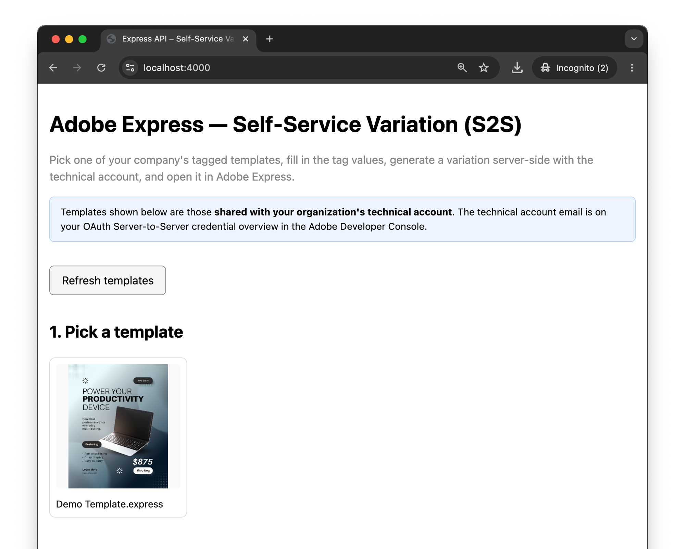
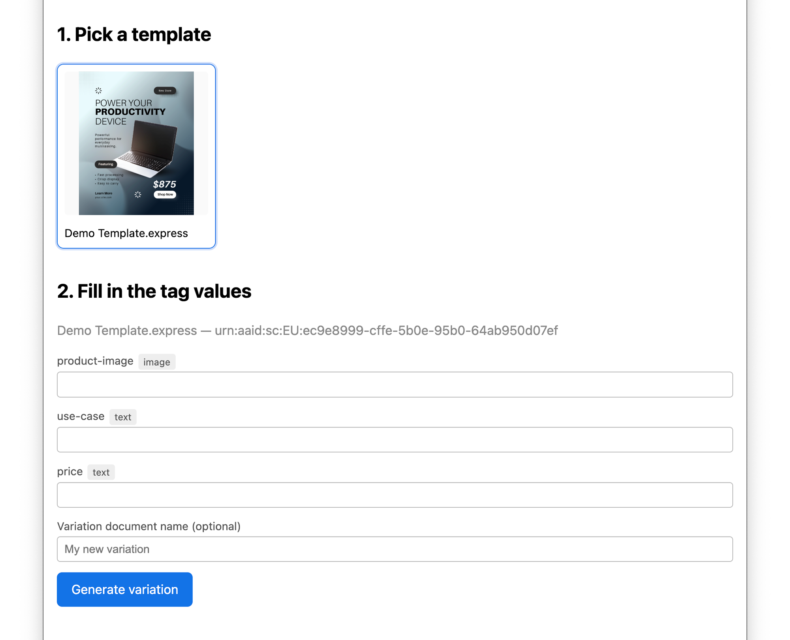
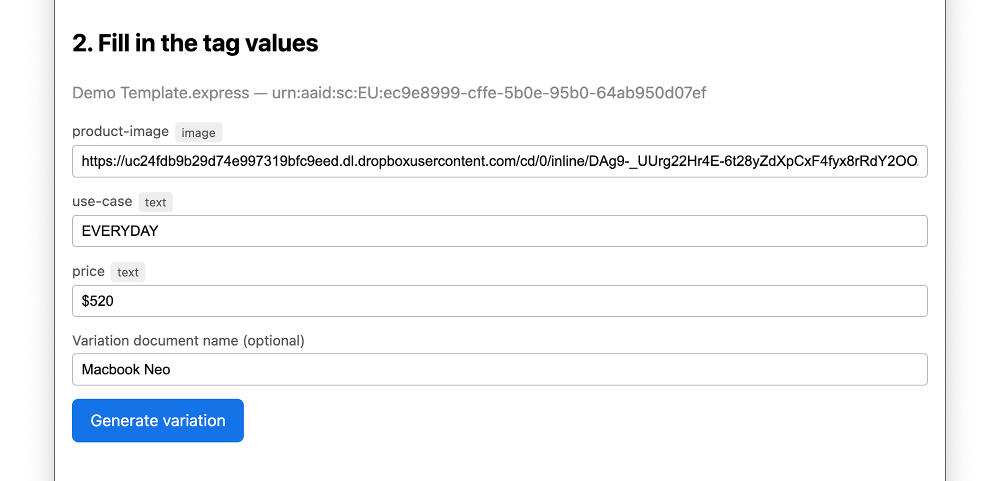
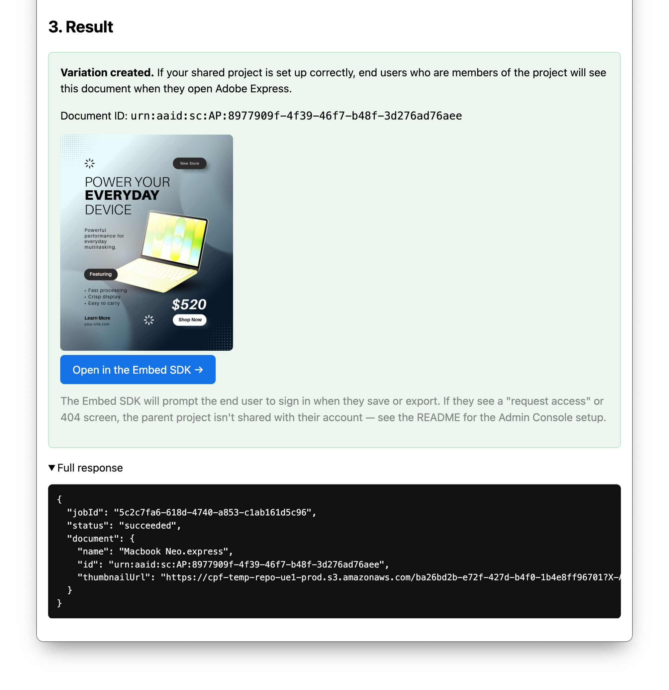
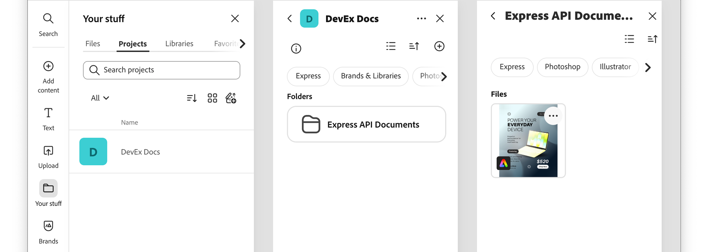
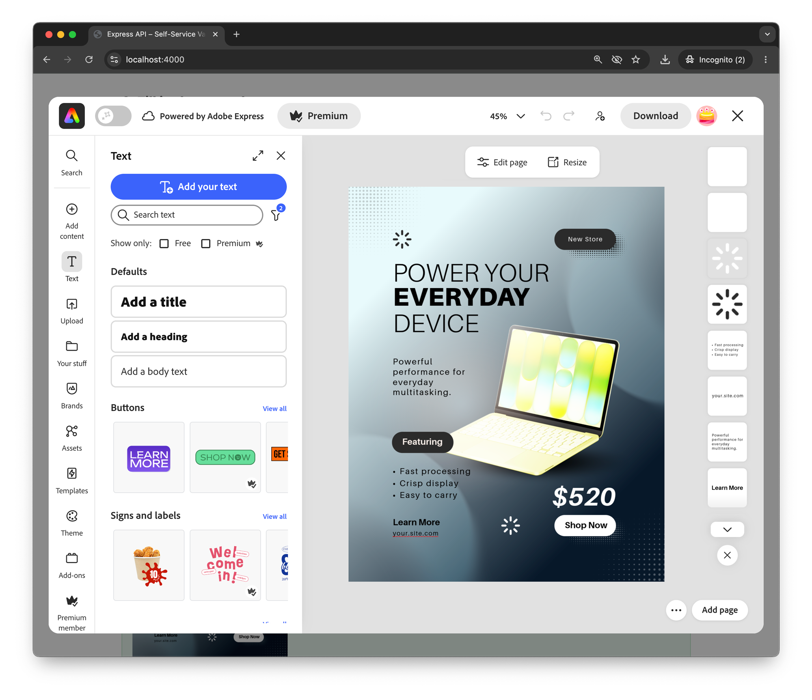

# Generate and Edit a Variant (Server-to-Server)

This guide walks through a complete end-to-end workflow using OAuth Server-to-Server authentication, covering a catalog of company-owned templates, variation generation, and final editing in Adobe Express using the Embed SDK.

## Overview

In this workflow, we present a Server-to-Server scenario where:

1. The **organization** owns a small catalog of tagged Express templates that are shared with the **technical account** of the Server-to-Server credential.
2. End users browse that shared catalog inside your app—no per-user OAuth sign-in.
3. Your backend generates a variation server-side using the technical account's access token.
4. The variation lands in an org-owned Express **Storage project shared with the end user**, so they can open it natively in the embedded Adobe Express experience and keep editing.

This pairs naturally with the [OAuth Web App workflow](./e2e-generate-edit-variant-oauth-web-app.md): use **OAuth** when each user works on **their own templates** and the variation should land in **their personal folder** in Adobe Express; use **Server-to-Server** when the **company curates the templates** and you want a **single backend integration** to drive variation creation and sharing.

## Prerequisites

Steps 1–5 below (token, list templates, inspect tags, generate, poll) work without any Admin Console setup—they rely only on the technical account's own capabilities and the templates you've directly shared with it. Only step 6 (the end user opening the variation via Embed SDK) requires the shared-project setup described under [Admin Console setup](#admin-console-setup).

### Developer and template authoring setup

You can complete all of this yourself, no Admin Console rights required:

- An Adobe Developer Console project with the **Adobe Express API** added and an [OAuth Server-to-Server credential](../../getting-started/create-credentials/index.md#server-to-server).
- Your `client_id` (API key), `client_secret`, and the **technical account email**—all visible on the credential overview page.
- Scopes such as `openid`, `AdobeID`, `read_organizations`, and `ee.express_api`.
- At least one tagged Express template **shared with the Technical Account**. In Adobe Express, open the doc → **Share** → paste the technical account email → **Can edit**. Tag elements with the [Tag Elements add-on](https://adobesparkpost.app.link/TR9Mb7TXFLb?mode=private&claimCode=wjmj67nj9:PLYN7XLJ).
- Node.js 18+ (or any backend that can do an HTTPS POST).

### Admin Console setup

<InlineAlert variant="info" slots="text" />

One-time setup, requires an Adobe org admin, needed only for the final hand-off to the end user.

- A **Storage project** shared with the Technical Account (Can edit) _and_ with the end-user accounts that will remix the templates. Project access is managed by an organization admin.
- The **Storage project URN**. You will pass this URN as `projectId` in step 4 so that variations land inside the shared project—not in the technical account's private storage. Without a `projectId`, end users won't see the variations. The URN is visible in the Admin Console's project URL:

```text
https://adminconsole.adobe.com/<ORG_ID>/storage/projects/<PROJECT_URN>
```

- The right entitlements on the technical account—an **Express product profile** (assigned in Developer Console) and, where org-wide cloud storage access is needed, **Storage administrator** plus a product license that includes **Enterprise Storage** (assigned in Admin Console). See the _Grant the technical account access to documents and assets_ section of [Create credentials – Server-to-Server](../../getting-started/create-credentials/index.md#server-to-server) for the authoritative guidance.

## 1. Get a Server-to-Server access token

Unlike the OAuth Web App flow, there is no user redirect. Your backend asks Adobe IMS directly for an access token using the `client_credentials` grant. **This call must be server-side** because it includes your `client_secret`.

<CodeBlock slots="heading, code" repeat="3" languages="bash, javascript, python" />

#### cURL

```bash
curl -s -X POST 'https://ims-na1.adobelogin.com/ims/token/v3' \
  -H 'Content-Type: application/x-www-form-urlencoded' \
  --data-urlencode 'grant_type=client_credentials' \
  --data-urlencode "client_id=$CLIENT_ID" \
  --data-urlencode "client_secret=$CLIENT_SECRET" \
  --data-urlencode 'scope=openid,AdobeID,ee.express_api'
```

#### JavaScript (Node 18+)

```js
const body = new URLSearchParams({
  grant_type: 'client_credentials',
  client_id: process.env.CLIENT_ID,
  client_secret: process.env.CLIENT_SECRET,
  scope: 'openid,AdobeID,ee.express_api',
});

const resp = await fetch('https://ims-na1.adobelogin.com/ims/token/v3', {
  method: 'POST',
  headers: { 'Content-Type': 'application/x-www-form-urlencoded' },
  body,
});
const tokens = await resp.json();
// tokens: { access_token, expires_in, token_type, ... }
```

#### Python

```python
import os, requests

resp = requests.post(
    "https://ims-na1.adobelogin.com/ims/token/v3",
    data={
        "grant_type": "client_credentials",
        "client_id": os.environ["CLIENT_ID"],
        "client_secret": os.environ["CLIENT_SECRET"],
        "scope": "openid,AdobeID,ee.express_api",
    },
)
tokens = resp.json()
```

Cache `access_token` in memory (or your secret store) until `Date.now() + (expires_in - 60) * 1000`. The token is org-scoped—every request below runs as the technical account, not as an end user. Keep both `client_secret` and the access token on the server.

## 2. List company templates

With the access token, list the templates available to the technical account. Send `Authorization: Bearer <ACCESS_TOKEN>` and `X-API-KEY: <CLIENT_ID>` (the same client ID from your credential). The response includes any document the technical account owns or has been shared on—i.e. your company-curated catalog, since you control which templates get shared with that account.

<InlineAlert variant="warning" slots="text" />

In a real app you should never call `https://express-api.adobe.io` directly from the browser; keep the access token and `client_secret` on the server and expose your own thin proxy routes (e.g. `/api/templates`, `/api/generate`) that forward to Adobe. The [companion sample app](https://github.com/AdobeDocs/express-api-samples/tree/main/oauth-server-to-server) shows this pattern end to end.

<CodeBlock slots="heading, code" repeat="3" languages="bash, javascript, python" />

#### cURL

```bash
curl -s 'https://express-api.adobe.io/beta/tagged-documents?start=0&limit=25&sortBy=-modifiedDate' \
  -H "Authorization: Bearer $ACCESS_TOKEN" \
  -H "X-API-KEY: $CLIENT_ID"
```

#### JavaScript (fetch)

```js
const resp = await fetch(
  'https://express-api.adobe.io/beta/tagged-documents?start=0&limit=25&sortBy=-modifiedDate',
  {
    headers: {
      Authorization: `Bearer ${accessToken}`,
      'X-API-KEY': clientId,
    },
  }
);
const { documents, paging } = await resp.json();
```

#### Python

```python
resp = requests.get(
    "https://express-api.adobe.io/beta/tagged-documents",
    params={"start": 0, "limit": 25, "sortBy": "-modifiedDate"},
    headers={
        "Authorization": f"Bearer {access_token}",
        "X-API-KEY": client_id,
    },
)
data = resp.json()
```

Response shape:

```json
{
  "documents": [
    {
      "id": "urn:aaid:sc:EU:e6723...",
      "name": "Demo Template.express",
      "thumbnailUrl": "https://aep-cs-blobstore-prod-irl1-data..."
    }
  ],
  "paging": {
    "totalRecords": 1,
    "nextUrl": ""
  }
}
```

The API does not currently support filtering by tag name or category server-side, so the "share with the technical account" convention _is_ your catalog filter. If you need finer control (for example, a single tech account with templates for several teams), use a name prefix and filter client-side.

Render each document's `thumbnailUrl` and `name` as a card and let the user click one. Keep the `id`—you need it for steps 3 and 4.



## 3. Inspect the template's tagged elements

Before the user can fill in tag values, your UI needs to know what tags the template actually has. Call `GET /beta/tagged-documents/{id}` for the selected document.

<CodeBlock slots="heading, code" repeat="3" languages="bash, javascript, python" />

#### cURL

```bash
curl -s "https://express-api.adobe.io/beta/tagged-documents/$DOCUMENT_ID" \
  -H "Authorization: Bearer $ACCESS_TOKEN" \
  -H "X-API-KEY: $CLIENT_ID"
```

#### JavaScript (fetch)

```js
const resp = await fetch(
  `https://express-api.adobe.io/beta/tagged-documents/${encodeURIComponent(documentId)}`,
  {
    headers: {
      Authorization: `Bearer ${accessToken}`,
      'X-API-KEY': clientId,
    },
  }
);
const detail = await resp.json();
```

#### Python

```python
import urllib.parse
url = f"https://express-api.adobe.io/beta/tagged-documents/{urllib.parse.quote(document_id, safe='')}"
detail = requests.get(url, headers={
    "Authorization": f"Bearer {access_token}",
    "X-API-KEY": client_id,
}).json()
```

The response lists each page and its `taggedElements`. The `type` of each tag tells you what input to render: `text` accepts a plain string; `image` and `video` accept a pre-signed URL on an allowed domain (AWS, Dropbox, Azure).

This endpoint is paginated by page: append `?start=<n>` to fetch tagged elements starting at page `n` if the template has more pages than the default page size returns.

```json
{
  "id": "urn:aaid:sc:EU:e6723...",
  "name": "Demo Template.express",
  "documentPages": [
    {
      "pageNumber": 1,
      "pageTitle": "",
      "size": { "width": 1080, "height": 1350 },
      "taggedElements": [
				{
					"name": "use-case", "type": "text",
					"position": { "x": 151, "y": 407 },
					"size": { "width": 662, "height": 93 },
					"value": "PRODUCTIVITY"
				},
				{
					"name": "price", "type": "text",
					"position": { "x": 611, "y": 1016 },
					"size": { "width": 301, "height": 93 },
					"value": "$875"
				}
        {
          "name": "product-image", "type": "image",
          "position": { "x":  257, "y":  358 },
          "size": { "width": 648, "height": 546 }
        }
      ],
      "thumbnailUrl": "https://aep-cs-blobstore-prod-irl1-data..."
    }
  ]
}
```



## 4. Generate the variation

Submit the user's values as `tagMappings`. The keys are the tag names from step 3; the values are strings (text) or pre-signed URLs (images, videos). The request shape is identical to the OAuth flow—only the bearer token and `projectId` differ.

Set `variationDetails.projectId` to the URN of the **shared project** from the [Admin Console setup](#prerequisites). This is what makes the variation visible to the end users you've shared that project with; omit it and the variation lands in the technical account's own `Express API Documents` folder, where end users have no access. `projectId` is optional in the OpenAPI spec but effectively required for this workflow.

<CodeBlock slots="heading, code" repeat="3" languages="bash, javascript, python" />

#### cURL

```bash
curl -s -X POST 'https://express-api.adobe.io/beta/generate-variation' \
  -H "Authorization: Bearer $ACCESS_TOKEN" \
  -H "X-API-KEY: $CLIENT_ID" \
  -H 'Content-Type: application/json' \
  -d '{
    "id": "'"$DOCUMENT_ID"'",
    "variationDetails": {
      "preferredDocumentName": "Macbook Neo",
      "projectId": "'"$SHARED_PROJECT_ID"'",
      "tagMappings": {
        "use-case": "EVERYDAY",
        "price": "$520",
        "product-image": "https://uc4fcd1dc97e1127dcb839ff192c.dl..."
      }
    }
  }'
```

#### JavaScript (fetch)

```js
const resp = await fetch('https://express-api.adobe.io/beta/generate-variation', {
  method: 'POST',
  headers: {
    Authorization: `Bearer ${accessToken}`,
    'X-API-KEY': clientId,
    'Content-Type': 'application/json',
  },
  body: JSON.stringify({
    id: documentId,
    variationDetails: {
      preferredDocumentName: 'Macbook Neo',
      projectId: sharedProjectId,
      tagMappings: {
        'use-case': "EVERYDAY",
        'price': "$520",
        'product-image': 'https://uc4fcd1dc97e1127dcb839ff192c.dl...',
      },
    },
  }),
});
const { jobId, statusUrl } = await resp.json();
```

#### Python

```python
resp = requests.post(
    "https://express-api.adobe.io/beta/generate-variation",
    headers={
        "Authorization": f"Bearer {access_token}",
        "X-API-KEY": client_id,
        "Content-Type": "application/json",
    },
    json={
        "id": document_id,
        "variationDetails": {
            "preferredDocumentName": "Macbook Neo",
            "projectId": shared_project_id,
            "tagMappings": {
                "use-case": "EVERYDAY",
                "price": "$520",
                "product-image": "https://uc4fcd1dc97e1127dcb839ff192c.dl..."
            },
        },
    },
)
job = resp.json()
```

Response (HTTP 202):

```json
{
  "jobId": "af121560-218e-4dd9-918d-add12b3b6d98",
  "statusUrl": "https://express-api.adobe.io/status/af121560-218e-4dd9-918d-add12b3b6d98"
}
```

The variation is created by the technical account. With a valid `projectId` and the Admin Console setup from [Prerequisites](#prerequisites) in place, it lands in the **shared project** and is visible to the end users you've shared that project with. Omit `projectId` and it lives in the technical account's own `Express API Documents` folder instead—fine for validating steps 1–5, but the end user won't be able to open it in step 6.

Hold on to `jobId` for the next step.



## 5. Poll the job

`GET /status/{jobId}` returns `running` until the variation is ready, then `succeeded` (or `failed`/`partially_succeeded`). Poll every few seconds.

<CodeBlock slots="heading, code" repeat="3" languages="bash, javascript, python" />

#### cURL

```bash
curl -s "https://express-api.adobe.io/status/$JOB_ID" \
  -H "Authorization: Bearer $ACCESS_TOKEN" \
  -H "X-API-KEY: $CLIENT_ID"
```

#### JavaScript (fetch)

```js
async function pollJob(jobId, accessToken, clientId) {
  while (true) {
    const r = await fetch(`https://express-api.adobe.io/status/${encodeURIComponent(jobId)}`, {
      headers: {
        Authorization: `Bearer ${accessToken}`,
        'X-API-KEY': clientId,
      },
    }).then((r) => r.json());
    if (['succeeded', 'failed', 'partially_succeeded'].includes(r.status)) return r;
    await new Promise((res) => setTimeout(res, 3000));
  }
}
```

#### Python

```python
import time

def poll_job(job_id, access_token, client_id):
    while True:
        r = requests.get(
            f"https://express-api.adobe.io/status/{job_id}",
            headers={
                "Authorization": f"Bearer {access_token}",
                "X-API-KEY": client_id,
            },
        ).json()
        if r["status"] in ("succeeded", "failed", "partially_succeeded"):
            return r
        time.sleep(3)
```

When the job succeeds, you get the new document back:

```json
{
  "jobId": "af121560-218e-4dd9-918d-add12b3b6d98",
  "status": "succeeded",
  "document": {
    "id": "urn:aaid:sc:EU:3da...",
    "name": "Macbook Neo",
    "thumbnailUrl": "https://...signed-url..."
  }
}
```



The variation is now stored in the user's account. Check the **My Stuff > Projects** section, select the Project and then the **Express API Documents** folder to see the variation.



## 6. Open the variation with the Adobe Express Embed SDK

The newly created document can be opened inside your own application using the Adobe Express Embed SDK. The Embed SDK exposes an **Editor Workflow** with an [`edit()`](https://developer.adobe.com/express/embed-sdk/docs/v4/sdk/src/workflows/3p/editor-workflow/classes/editor-workflow#edit) method that takes the same `documentId` (the variation URN returned in step 5) and launches the Full Editor experience in your page.

### 6.1 Load and initialize the SDK

Load the SDK script, then call `CCEverywhere.initialize` once with the Embed SDK's Client ID and an `appName` that matches the **Public App Name** you set in the Developer Console.

<InlineAlert variant="info" slots="heading, text" />

#### Embed SDK and Express API Client IDs

The Embed SDK and Express API rely on **different Client IDs**. Both are generated when you create credentials in the Developer Console, but the Projects that contain them are independent.

```js
  await import('https://cc-embed.adobe.com/sdk/v4/CCEverywhere.js');

  const hostInfo = {
    clientId: '<CLIENT_ID>',
    appName: 'Embed SDK & Express API integration',
  };

  // lets the user start interacting with the embedded editor; sign-in is only prompted when they save or export.
  const configParams = { loginMode: 'delayed' };

  const { editor } = await window.CCEverywhere.initialize(hostInfo, configParams);
```

### 6.2 Open the variation for editing

Pass the variation URN from step 5 as `documentId` and call `editor.edit()`:

```js
const docConfig = { documentId: '<DOCUMENT_URN>' };
const appConfig = {};       // optional editor configuration
const exportConfig = [];    // optional export targets
const containerConfig = {}; // optional container configuration
editor.edit(docConfig, appConfig, exportConfig);
```



For the full surface ([`appConfig`](https://developer.adobe.com/express/embed-sdk/docs/v4/shared/src/types/editor/app-config-types/interfaces/base-editor-app-config), [`exportConfig`](https://developer.adobe.com/express/embed-sdk/docs/v4/shared/src/types/export-config-types/type-aliases/export-options), [`containerConfig`](https://developer.adobe.com/express/embed-sdk/docs/v4/shared/src/types/container-config-types/type-aliases/container-config)), and other entry points available, please refer to the [Adobe Express Embed SDK documentation](https://developer.adobe.com/express/embed-sdk/docs/guides/).

<InlineAlert variant="info" slots="heading, text" />

#### Open in Adobe Express

Alternatively, you can open the variation in Adobe Express (in a new Browser tab) by deep-linking to it via its URN: `https://express.adobe.com/id/<DOCUMENT_URN>`.

## Next steps

- Run the full flow end to end with the [companion sample app](https://github.com/AdobeDocs/express-api-samples/tree/main/oauth-server-to-server) (Node/Express backend + a single static HTML page, Server-to-Server variant).
- Need to skip the "open in Express" hand-off entirely and just give the user a finished asset? Add a [rendition export step](./export-document.md) right after step 5 to return a JPG/PNG/MP4/PDF instead.
- Building the per-user variant of this workflow where each user picks from their own templates and the variation lands in their personal **My Stuff**? See [Generate and Edit a Variant (OAuth Web App)](./e2e-generate-edit-variant-oauth-web-app.md)—steps 2 through 6 are identical; only step 1 differs.
