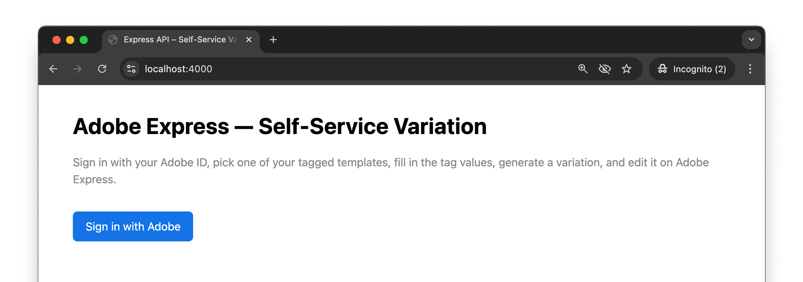
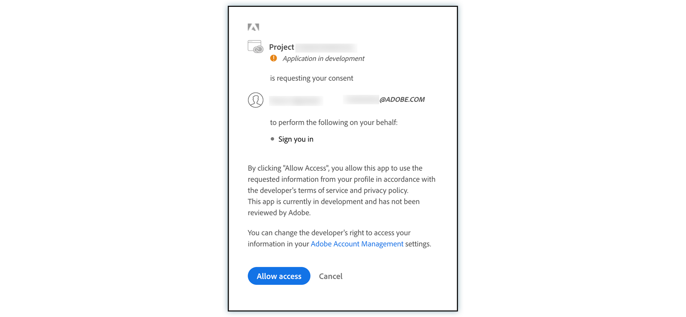
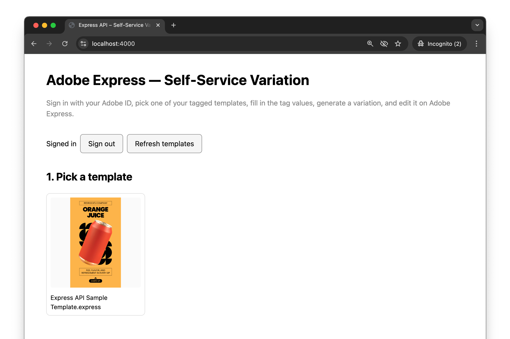
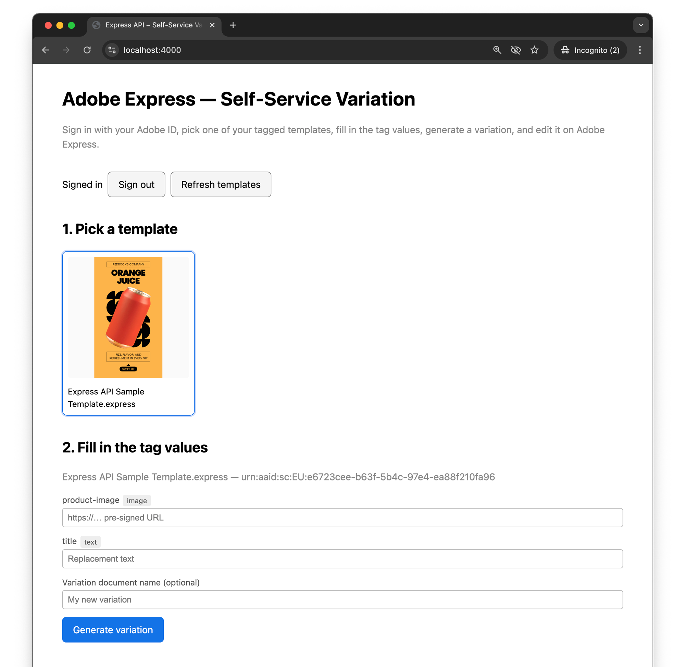
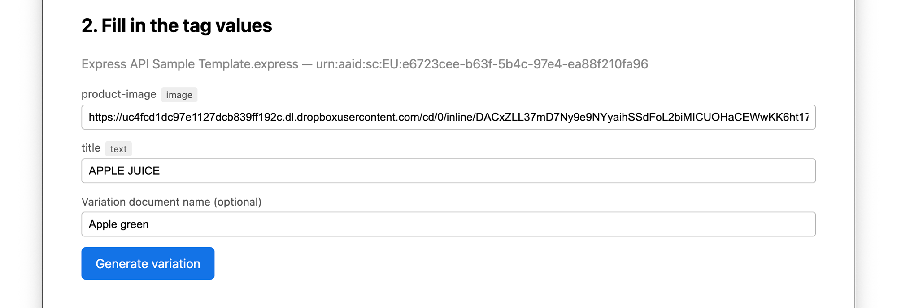
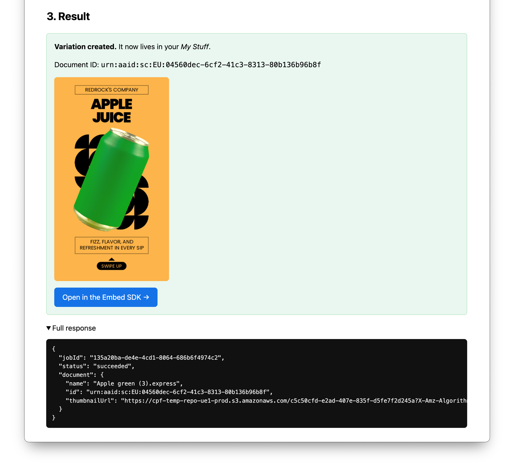
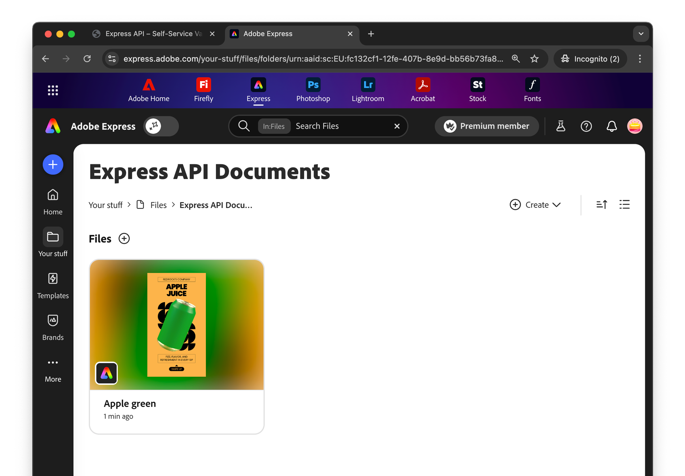
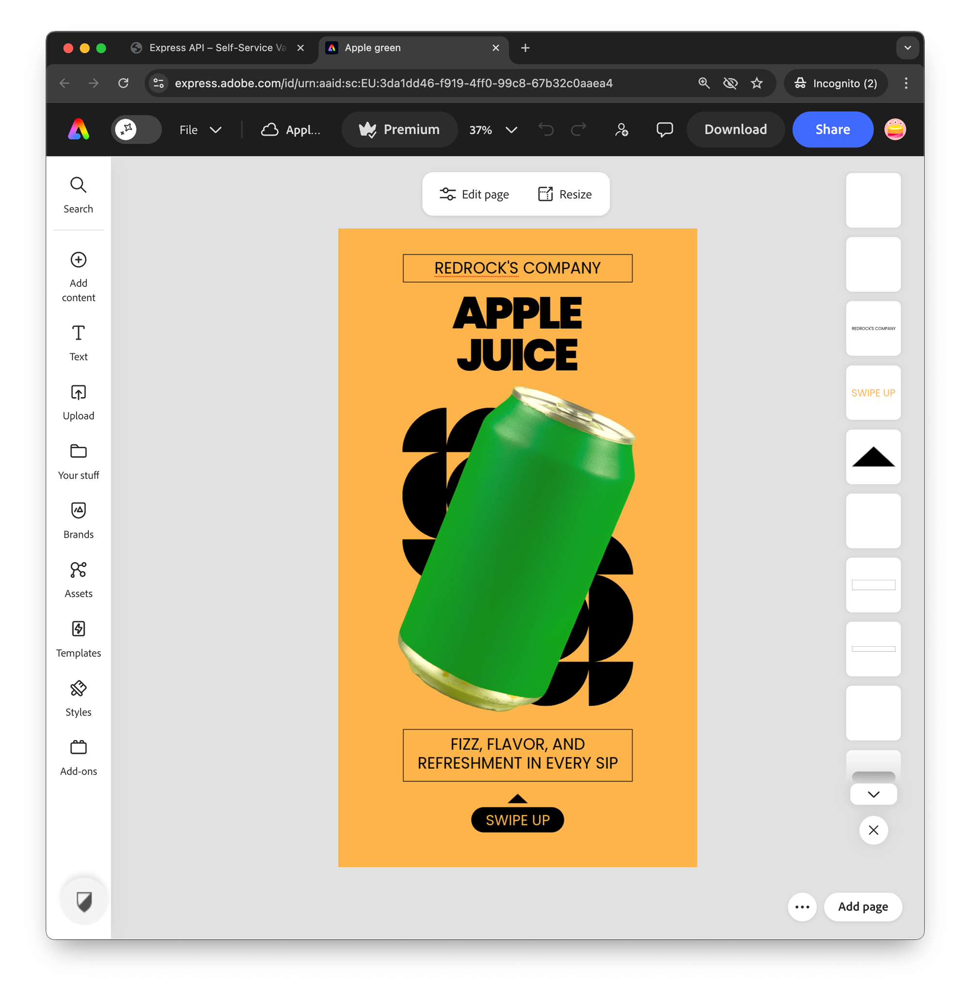

# Generate and Edit a Variant (OAuth Web App)

This guide walks through a complete end-to-end workflow using OAuth Web App authentication, covering template selection, variation generation, and final editing in Adobe Express.

## Overview

In this workflow, we present a Web App-based scenario where a user:

1. Authenticates (OAuth) with their Adobe ID
2. Chooses one of their previously tagged templates in Adobe Express
3. Generates a variation by replacing tagged elements (text, images, videos)
4. Refines the result by editing the generated document in Adobe Express

## Prerequisites

- An Adobe Developer Console project with the **Adobe Express API** added and an [OAuth Web App credential](../concepts/create-credentials/index.md#user-authentication-oauth-webapp).
  - Make sure to have `openid`, `AdobeID`, and `ee.express_api` scopes added to the credential.
- A redirect URI registered on the credential.
  - Use, e.g., `https://localhost:4000/callback` for local development (Adobe IMS requires HTTPS for redirect URIs even on localhost). Set this as both the **Default Redirect URI** and as the **Redirect URI pattern** (`https://localhost:4000/callback$`) on the credential.
- Your `client_id` (API key) and `client_secret` from the credential overview page.
- At least one tagged Express document the signed-in user owns. Tag it with the [Tag Elements add-on](https://adobesparkpost.app.link/TR9Mb7TXFLb?mode=private&claimCode=wjmj67nj9:PLYN7XLJ).
- Node.js 18+ (or any backend that can do an HTTPS POST and run a small redirect handler).

The cURL and Python tabs in the steps below assume you already have an `ACCESS_TOKEN` from the OAuth flow in the [first step](#1-authenticate-the-user). During development, log it from your `/callback` handler the first time it succeeds and reuse it for the day. Tokens are valid roughly 24 hours; once a token expires the user must sign in again. If your credential has the `offline_access` scope available (check the **Available Scopes** section of your OAuth Web App credential in the Developer Console), you can also receive a refresh token.

## 1. Authenticate the user

This is the only step that isn't a single API call. The user's browser bounces to Adobe's identity service, comes back to your callback with a short-lived `code`, and your backend exchanges that `code` for an access token.



### 1.1 Send the user to Adobe's authorize endpoint

When the user signs in, redirect them to:

```text
https://ims-na1.adobelogin.com/ims/authorize/v2
  ?client_id=<CLIENT_ID>
  &redirect_uri=<REDIRECT_URI>
  &response_type=code
  &scope=openid%20AdobeID%20ee.express_api
  &state=<RANDOM_STATE>
```

`state` is an opaque random string you generate and store in the user's session; verify it matches when Adobe calls you back to prevent Cross-Site Request Forgery (CSRF). For a working `/login` + `/callback` pair (state generation, verification, and token exchange), see the [companion sample app](https://github.com/AdobeDocs/express-api-samples).

When the user signs in, they will see the following consent screen:



Adobe then redirects the browser to your `redirect_uri` with `?code=...&state=...`.

### 1.2 Exchange the code for tokens

Your backend POSTs the `code` to Adobe's token endpoint. **This call must be server-side** because it includes your `client_secret`.

<CodeBlock slots="heading, code" repeat="3" languages="bash, javascript, python" />

#### cURL

```bash
curl -s -X POST 'https://ims-na1.adobelogin.com/ims/token/v3' \
  -H 'Content-Type: application/x-www-form-urlencoded' \
  --data-urlencode 'grant_type=authorization_code' \
  --data-urlencode "code=$CODE" \
  --data-urlencode "client_id=$CLIENT_ID" \
  --data-urlencode "client_secret=$CLIENT_SECRET"
```

#### JavaScript (Node 18+)

```js
const body = new URLSearchParams({
  grant_type: 'authorization_code',
  code,
  client_id: process.env.CLIENT_ID,
  client_secret: process.env.CLIENT_SECRET,
});

const resp = await fetch('https://ims-na1.adobelogin.com/ims/token/v3', {
  method: 'POST',
  headers: { 'Content-Type': 'application/x-www-form-urlencoded' },
  body,
});
const tokens = await resp.json();
// tokens: { access_token, refresh_token, expires_in, token_type, ... }
```

#### Python

```python
import os, requests

resp = requests.post(
    "https://ims-na1.adobelogin.com/ims/token/v3",
    data={
        "grant_type": "authorization_code",
        "code": code,
        "client_id": os.environ["CLIENT_ID"],
        "client_secret": os.environ["CLIENT_SECRET"],
    },
)
tokens = resp.json()
```

Store `access_token`, `refresh_token`, and the absolute expiry time (`Date.now() + (expires_in - 60) * 1000`) in the user's session.

## 2. List the user's tagged templates

Once you have an access token, list the user's tagged templates so they can pick one. Use the `Authorization: Bearer <ACCESS_TOKEN>` header from the first step and your `X-API-KEY` (the same `client_id` from your credential).

<InlineAlert variant="warning" slots="text" />

The JavaScript snippets in steps 2–5 show the raw API call for clarity. In a real web app you should never call `https://express-api.adobe.io` directly from the browser; keep the access token and `client_secret` on the server and expose your own thin proxy routes (e.g. `/api/templates`, `/api/generate`) that forward to Adobe. The [companion sample app](https://github.com/AdobeDocs/express-api-samples) shows this pattern end to end.

<CodeBlock slots="heading, code" repeat="3" languages="bash, javascript, python" />

#### cURL

```bash
curl -s 'https://express-api.adobe.io/beta/tagged-documents?start=0&limit=25&sortBy=-modifiedDate' \
  -H "Authorization: Bearer $ACCESS_TOKEN" \
  -H "X-API-KEY: $CLIENT_ID"
```

#### JavaScript (fetch)

```js
const resp = await fetch(
  'https://express-api.adobe.io/beta/tagged-documents?start=0&limit=25&sortBy=-modifiedDate',
  {
    headers: {
      Authorization: `Bearer ${accessToken}`,
      'X-API-KEY': clientId,
    },
  }
);
const { documents, paging } = await resp.json();
```

#### Python

```python
resp = requests.get(
    "https://express-api.adobe.io/beta/tagged-documents",
    params={"start": 0, "limit": 25, "sortBy": "-modifiedDate"},
    headers={
        "Authorization": f"Bearer {access_token}",
        "X-API-KEY": client_id,
    },
)
data = resp.json()
```

Response shape:

```json
{
  "documents": [
    {
      "id": "urn:aaid:sc:EU:e6723...",
      "name": "Express API Sample Template.express",
      "thumbnailUrl": "https://aep-cs-blobstore-prod-irl1-data..."
    }
  ],
  "paging": {
		"totalRecords": 1,
		"nextUrl": ""
	}
}
```

Render each document's `thumbnailUrl` and `name` as a card in your UI and let the user click one to select it. Keep the `id` — you need it for steps 3 and 4.



## 3. Inspect the template's tagged elements

Before the user can fill in tag values, your UI needs to know what tags the template actually has. Call `GET /beta/tagged-documents/{id}` for the selected document.

<CodeBlock slots="heading, code" repeat="3" languages="bash, javascript, python" />

#### cURL

```bash
curl -s "https://express-api.adobe.io/beta/tagged-documents/$DOCUMENT_ID" \
  -H "Authorization: Bearer $ACCESS_TOKEN" \
  -H "X-API-KEY: $CLIENT_ID"
```

#### JavaScript (fetch)

```js
const resp = await fetch(
  `https://express-api.adobe.io/beta/tagged-documents/${encodeURIComponent(documentId)}`,
  {
    headers: {
      Authorization: `Bearer ${accessToken}`,
      'X-API-KEY': clientId,
    },
  }
);
const detail = await resp.json();
```

#### Python

```python
import urllib.parse
url = f"https://express-api.adobe.io/beta/tagged-documents/{urllib.parse.quote(document_id, safe='')}"
detail = requests.get(url, headers={
    "Authorization": f"Bearer {access_token}",
    "X-API-KEY": client_id,
}).json()
```

The response lists each page and its `taggedElements`. The `type` of each tag tells you what input to render: `text` accepts a plain string; `image` and `video` accept a pre-signed URL on an allowed domain (AWS, Dropbox, Azure).

This endpoint is paginated by page: append `?start=<n>` to fetch tagged elements starting at page `n` if the template has more pages than the default page size returns.

```json
{
  "id": "urn:aaid:sc:EU:e6723...",
  "name": "Express API Sample Template.express",
  "documentPages": [
    {
      "pageNumber": 1,
      "pageTitle": "",
      "size": { "width": 662, "height": 289 },
      "taggedElements": [
        {
          "name": "title", "type": "text",
          "position": { "x": 209, "y": 185 },
          "size": { "width": 662, "height": 289 }
        },
        {
          "name": "product-image", "type": "image",
          "position": { "x":  346, "y":  -131 },
          "size": { "width": 493, "height": 963 }
        }
      ],
      "thumbnailUrl": "https://aep-cs-blobstore-prod-irl1-data..."
    }
  ]
}
```



## 4. Generate the variation

Submit the user's values as `tagMappings`. The keys are the tag names from step 3; the values are strings (text) or pre-signed URLs (images, videos).

<CodeBlock slots="heading, code" repeat="3" languages="bash, javascript, python" />

#### cURL

```bash
curl -s -X POST 'https://express-api.adobe.io/beta/generate-variation' \
  -H "Authorization: Bearer $ACCESS_TOKEN" \
  -H "X-API-KEY: $CLIENT_ID" \
  -H 'Content-Type: application/json' \
  -d '{
    "id": "'"$DOCUMENT_ID"'",
    "variationDetails": {
      "preferredDocumentName": "Apple green",
      "tagMappings": {
        "title": "APPLE GREEN",
        "product-image": "https://uc4fcd1dc97e1127dcb839ff192c.dl..."
      }
    }
  }'
```

#### JavaScript (fetch)

```js
const resp = await fetch('https://express-api.adobe.io/beta/generate-variation', {
  method: 'POST',
  headers: {
    Authorization: `Bearer ${accessToken}`,
    'X-API-KEY': clientId,
    'Content-Type': 'application/json',
  },
  body: JSON.stringify({
    id: documentId,
    variationDetails: {
      preferredDocumentName: 'Apple green',
      tagMappings: {
        title: 'APPLE GREEN',
        'product-image': 'https://uc4fcd1dc97e1127dcb839ff192c.dl...',
      },
    },
  }),
});
const { jobId, statusUrl } = await resp.json();
```

#### Python

```python
resp = requests.post(
    "https://express-api.adobe.io/beta/generate-variation",
    headers={
        "Authorization": f"Bearer {access_token}",
        "X-API-KEY": client_id,
        "Content-Type": "application/json",
    },
    json={
        "id": document_id,
        "variationDetails": {
            "preferredDocumentName": "Apple green",
            "tagMappings": {
                "title": "APPLE GREEN",
                "product-image": "https://uc4fcd1dc97e1127dcb839ff192c.dl...",
            },
        },
    },
)
job = resp.json()
```

Response (HTTP 202):

```json
{
  "jobId": "af121560-218e-4dd9-918d-add12b3b6d98",
  "statusUrl": "https://express-api.adobe.io/status/af121560-218e-4dd9-918d-add12b3b6d98"
}
```

Hold on to `jobId` — that's the handle you'll poll in the next step.



## 5. Poll the job

`GET /status/{jobId}` returns `running` until the variation is ready, then `succeeded` (or `failed`/`partially_succeeded`). Poll every few seconds.

<CodeBlock slots="heading, code" repeat="3" languages="bash, javascript, python" />

#### cURL

```bash
curl -s "https://express-api.adobe.io/status/$JOB_ID" \
  -H "Authorization: Bearer $ACCESS_TOKEN" \
  -H "X-API-KEY: $CLIENT_ID"
```

#### JavaScript (fetch)

```js
async function pollJob(jobId, accessToken, clientId) {
  while (true) {
    const r = await fetch(`https://express-api.adobe.io/status/${encodeURIComponent(jobId)}`, {
      headers: {
        Authorization: `Bearer ${accessToken}`,
        'X-API-KEY': clientId,
      },
    }).then((r) => r.json());
    if (['succeeded', 'failed', 'partially_succeeded'].includes(r.status)) return r;
    await new Promise((res) => setTimeout(res, 3000));
  }
}
```

#### Python

```python
import time

def poll_job(job_id, access_token, client_id):
    while True:
        r = requests.get(
            f"https://express-api.adobe.io/status/{job_id}",
            headers={
                "Authorization": f"Bearer {access_token}",
                "X-API-KEY": client_id,
            },
        ).json()
        if r["status"] in ("succeeded", "failed", "partially_succeeded"):
            return r
        time.sleep(3)
```

When the job succeeds, you get the new document back:

```json
{
  "jobId": "af121560-218e-4dd9-918d-add12b3b6d98",
  "status": "succeeded",
  "document": {
    "id": "urn:aaid:sc:EU:3da...",
    "name": "Apple green",
    "thumbnailUrl": "https://...signed-url..."
  }
}
```



The variation is now stored in the user's account, inside an **Express API Documents** folder in **My Stuff**.



## 6. Open the variation in Adobe Express

Adobe Express can deep-link to a document by its URN. Build the URL from the `document.id` returned in step 5:

```text
https://express.adobe.com/id/<DOCUMENT_URN>
```

Render that as a button on your success view:

```html
<a href="https://express.adobe.com/id/urn:aaid:sc:EU:3da..."
   target="_blank" rel="noopener">
  Open in Adobe Express &rarr;
</a>
```

The user lands on their freshly generated document inside Adobe Express, where they can keep editing it like any other document.



## Next steps

- Run the full flow end to end with the [companion sample app](https://github.com/AdobeDocs/express-api-samples) (Node/Express backend + a single static HTML page).
- Need to export the variation as JPG/PNG/MP4/PDF programmatically rather than handing it back to the user? Add a [rendition export step](./export-document.md) right after step 5.
- Building the company-owned-templates variant of this workflow with **Server-to-Server** auth instead of OAuth Web App? See [Server-to-Server Authentication](../concepts/create-credentials/index.md#server-to-server-authentication-1)—steps 2 through 6 above stay the same; only the first step changes.
