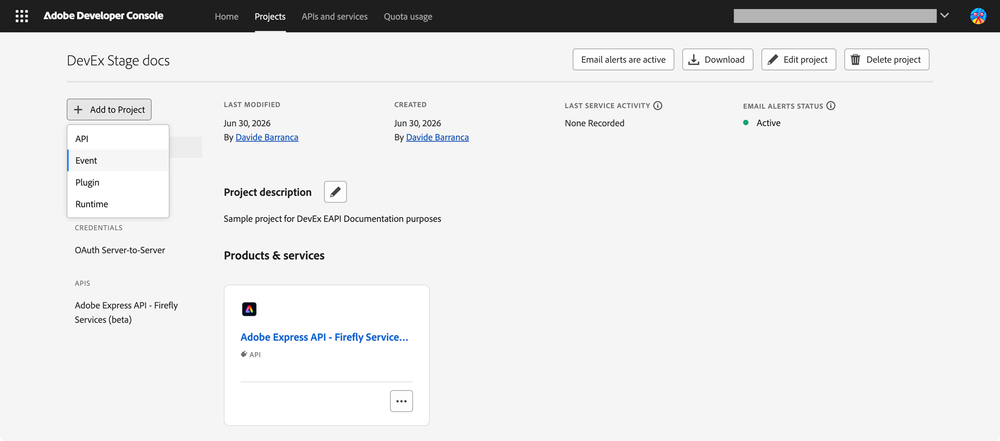
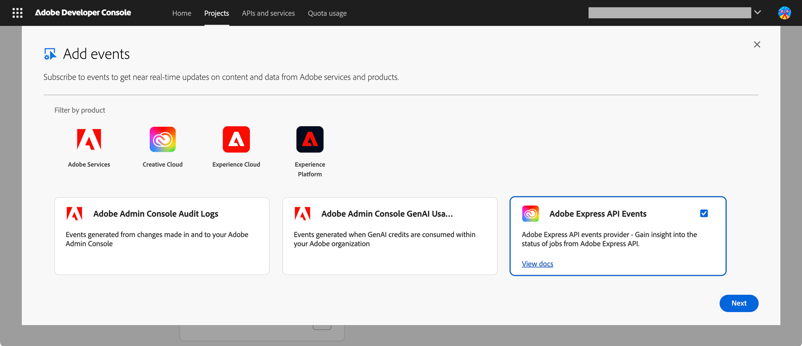
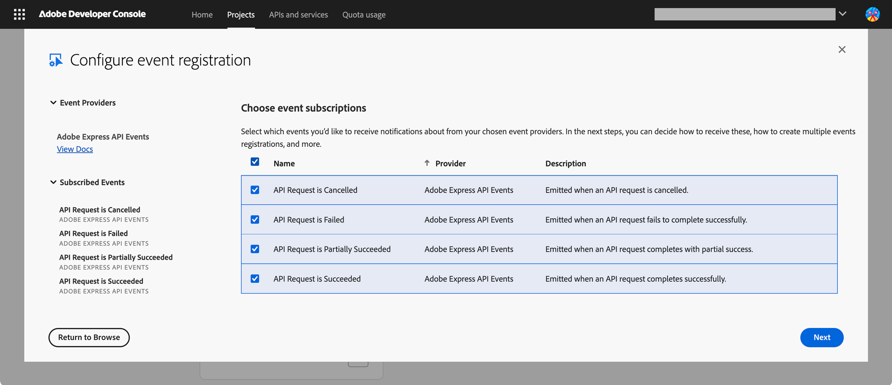
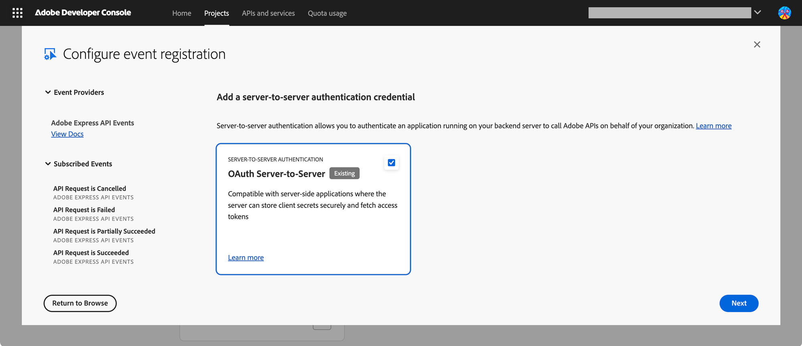
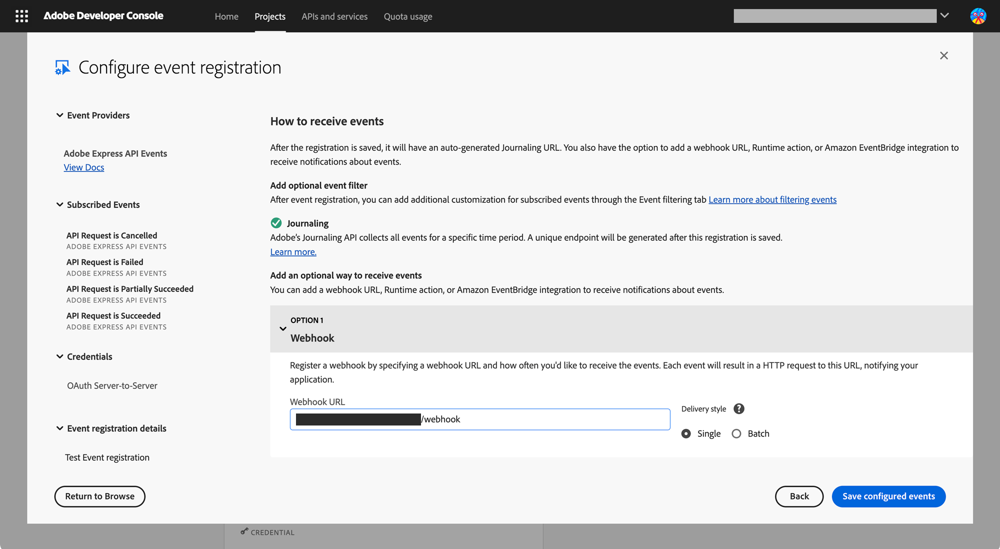
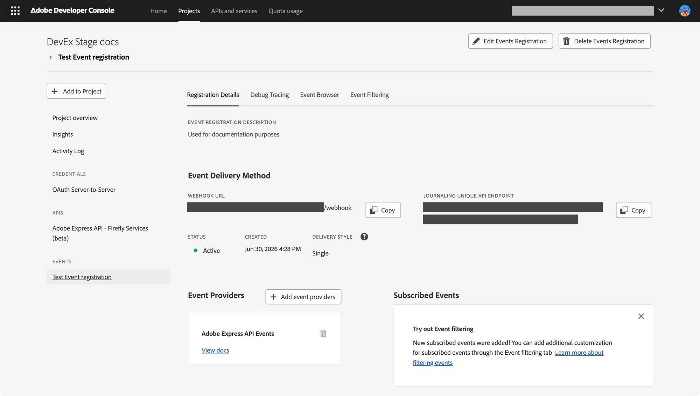
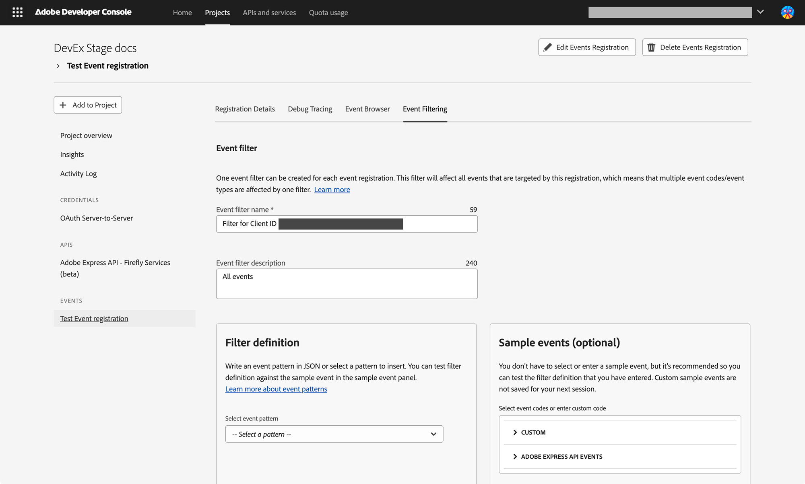

# Handle Webhook Events

Learn how to register a webhook in the Adobe Developer Console and receive real-time job completion notifications.

## Overview

When you submit a job, such as `bulk-create-variation`, `create-variation`, or `export-rendition`, the Express API runs the job asynchronously and returns a `jobId`. Without webhooks, you must call the `/status` endpoint repeatedly until the job finishes.

With **webhook support**, you register an HTTPS endpoint once in the Developer Console. When the job reaches a terminal state (succeeded, failed, partially succeeded, or cancelled), the Express API publishes an event to [Adobe I/O Events](https://developer.adobe.com/events/docs/), which then delivers a notification to your endpoint. Your application is notified immediately—no polling required.

<InlineAlert variant="warning" slots="text" />

Webhook support is available for the **Bulk Workflow APIs**, **Create Variation** (`POST /beta/create-variation`), and **Export Rendition** (`POST /beta/export-rendition`).

## How it works

1. Register a webhook endpoint in your Developer Console project under the **Adobe Express API** events card.
2. Submit an async request (for example, `POST /bulk-create-variation`, `POST /beta/create-variation`, or `POST /beta/export-rendition`). The API returns a `jobId`.
3. The Express API processes the job asynchronously.
4. When the job reaches a terminal state, the Express API publishes a CloudEvents-formatted event to Adobe I/O Events.
5. Adobe I/O Events delivers the notification to your registered webhook URL. The notification contains at minimum the `jobId` and `status`; additional fields are optional depending on the event type.
6. Your application handles the notification and—if needed—calls the `/status` endpoint once to retrieve full job details.

## Prerequisites

Before you register a webhook:

- **A Developer Console project with the Adobe Express API added.** Follow the [Create Credentials](../../getting-started/create-credentials/index.md) guide to set up a project with OAuth Server-to-Server credentials.
- **A publicly accessible HTTPS webhook endpoint.** Your server must be reachable from the internet (not localhost) and must respond correctly to a [challenge request](#challenge-request) during registration. For local development, you can use [ngrok](https://ngrok.com/) or [webhook.site](https://webhook.site/) as a temporary endpoint.

<InlineAlert variant="info" slots="text" />

To subscribe to events and receive notifications, **Adobe Express API** (which requires the appropriate Firefly/Express API entitlement for your organization) must be added to your project.

## Register your webhook in the Adobe Developer Console

### 1. Open your project and add the Adobe Express API events

- Sign in at [Adobe Developer Console](https://developer.adobe.com/console/home) and open your project (or create a new one).
- Click **Add to Project** and select **Event**.



- In the event catalog, filter by **Creative Cloud** and select **Adobe Express API**. Click **Next**.



### 2. Subscribe to events

Select the event types you want to receive. Choose from the four available events:

- API Request is Cancelled
- API Request is Failed
- API Request is Partially Succeeded
- API Request is Succeeded

You can subscribe to any combination. Click **Next**.



### 3. Set up OAuth Server-to-Server credentials

When prompted for a credential type, select **OAuth Server-to-Server** (or choose your existing credential). This credential is used to authenticate your application's API calls; it is separate from the webhook delivery mechanism.



In the following screen (not illustrated here), you'll be able to provide a name and description for this event registration.

### 4. Configure the event registration

In the following screen, configure your webhook URL and delivery options:

1. Enable **Webhook**.
2. Enter your publicly accessible HTTPS webhook URL.
3. Choose **Batch** delivery if you prefer to receive multiple events in a single HTTP request (recommended for high-volume workloads); otherwise leave it as **Single**.



#### Challenge request

When you save the registration, Adobe I/O Events sends a one-time HTTP GET request to your webhook URL with a `challenge` query parameter. Your endpoint must respond with the challenge value to prove it is reachable. For example:

```http
GET https://your-endpoint.example.com/webhook?challenge=8ec8d794-e0ab-42df-9017-e3dada8e84f7
```

Your endpoint should respond with:

```http
HTTP/1.1 200 OK
Content-Type: application/json

{"challenge":"8ec8d794-e0ab-42df-9017-e3dada8e84f7"}
```

For full details on synchronous and asynchronous challenge validation, see [Introduction to Adobe I/O Events Webhooks](https://developer.adobe.com/events/docs/guides/#the-challenge-request).

### 5. Verify the registration

After saving, check that the **Status** shown in the _Registration Details_ tab is **Active**. If it shows **Disabled**, your endpoint did not respond correctly to the challenge request. Re-check the URL and challenge handler, then edit the registration to re-trigger the challenge.



## Event types

Adobe Express API exposes four events for its asynchronous APIs. All events follow the [CloudEvents 1.0 specification](https://cloudevents.io/).

| Event type                                     | Description                                                            |
| ---------------------------------------------- | ------------------------------------------------------------------------ |
| `com.adobe.express-api.v1.succeeded`           | Emitted when the job completed successfully.                            |
| `com.adobe.express-api.v1.partially_succeeded` | Emitted when the job completed with mixed results.                      |
| `com.adobe.express-api.v1.failed`              | Emitted when the job failed to complete successfully.                   |
| `com.adobe.express-api.v1.cancelled`           | Emitted when the job was cancelled before completion.                   |

## Event payload structure

Events are delivered as HTTP POST requests to your webhook URL. The body is a JSON object following the [CloudEvents spec](https://cloudevents.io/). See below for example payloads for a Succeeded and a Cancelled events.

<CodeBlock slots="heading, code" repeat="2" languages="json, json"/>

#### Succeeded

```json
{
  "specversion": "1.0",
  "type": "com.adobe.express-api.v1.succeeded",
  "source": "urn:aio_provider_metadata:cc_ffs_exapi_job_status",
  "id": "5b5341fb-b4c1-422d-bc1a-b4ca248ec6da",
  "time": "2026-06-23T13:57:12.303Z",
  "datacontenttype": "application/json",
  "adobeinternal": {
    "imsOrg": "<YOUR_IMS_ORG_ID>@AdobeOrg"
  },
  "requestorclientid": "<YOUR_CLIENT_ID>",
  "apiendpoint": "beta/create-variation",
  "data": {
    "jobId": "57b96a1e-4896-4cad-bb82-b5674454b4b5",
    "status": "succeeded",
    "outputs": [
      {
        "destination": {
          "url": "https://example.com/output-manifest.json"
        },
        "mediaType": "application/json"
      }
    ]
  }
}
```

#### Cancelled

```json
{
  "specversion": "1.0",
  "type": "com.adobe.express-api.v1.cancelled",
  "source": "urn:aio_provider_metadata:cc_ffs_exapi_job_status",
  "id": "8023f672-0de6-41cd-bbb9-e99b0a142560",
  "time": "2026-06-23T13:57:12.303Z",
  "datacontenttype": "application/json",
  "adobeinternal": {
    "imsOrg": "<YOUR_IMS_ORG_ID>@AdobeOrg"
  },
  "requestorclientid": "<YOUR_CLIENT_ID>",
  "apiendpoint": "bulk-create-variation",
  "data": {
    "jobId": "57b96a1e-4896-4cad-bb82-b5674454b4b5",
    "status": "cancelled",
    "progress": {
      "injectedRecords": 1000,
      "processedRecords": 0,
      "totalRecords": 1000
    },
    "summary": {
      "failedRecords": 0,
      "successfulRecords": 0,
      "totalRecords": 1000
    }
  }
}
```

## Field descriptions

### Top-level fields

| Field             | Description                                                                         |
| ----------------- | ----------------------------------------------------------------------------------- |
| `specversion`     | CloudEvents specification version. Always `"1.0"`.                                  |
| `type`            | Event type string used for routing and filtering (see [Event types](#event-types)). |
| `source`          | Context in which the event occurred.                                                |
| `id`              | Unique UUID generated for each event delivery.                                      |
| `time`            | ISO 8601 timestamp of the job's terminal state.                                     |
| `datacontenttype` | Content type of the `data` payload. Always `"application/json"`.                    |
| `adobeinternal`   | Adobe-specific extension containing IMS organization information.                   |
| `requestorclientid` | Client ID of the application that submitted the API request.                     |
| `apiendpoint`     | Version and name of the API that was called (for example, `beta/create-variation`). |
| `data`            | Event data object containing job information (see below).                           |

### `data` object fields

| Field           | Required | Description                                                                                                                                              |
| --------------- | -------- | -------------------------------------------------------------------------------------------------------------------------------------------------------- |
| `data.jobId`    | Yes      | ID of the completed job.                                                                                                                                 |
| `data.status`   | Yes      | Terminal status of the job: `"succeeded"`, `"failed"`, `"partially_succeeded"`, or `"cancelled"`.                                                        |
| `data.outputs`  | No       | Presigned URL(s) to download the job's output manifest. Present on `succeeded` and `partially_succeeded` events.                                         |
| `data.summary`  | No       | Final tally of records: `failedRecords`, `successfulRecords`, and `totalRecords`. Present on `succeeded`, `partially_succeeded`, and `cancelled` events. |
| `data.progress` | No       | Record counts at the time of cancellation: `injectedRecords`, `processedRecords`, and `totalRecords`. Present on `cancelled` events.                     |

<InlineAlert variant="info" slots="text" />

`data.jobId` and `data.status` are the only guaranteed fields in every notification. Your application should treat all other `data` fields as optional and handle their absence gracefully.

For bulk operations, `data.summary` has the following shape:

```json
{
  "failedRecords": 0,
  "successfulRecords": 1000,
  "totalRecords": 1000
}
```

## Event filtering

Adobe I/O Events uses a **fan-out** model at the organization level: when an event is published, it is delivered to all registrations that exist within the same IMS organization, regardless of which project created the job. If you have multiple projects in your organization, all of their webhook registrations may receive an event.

To ensure your webhook only receives events relevant to your application, apply a **client ID filter** when configuring your event registration.



1. In the event registration settings, locate the **Event Filtering** section.
2. Name and describe your filter (for example, "Filter by Client ID").
3. Add a filter on **Client ID** matching the client ID of your OAuth Server-to-Server credential.

```json
{
  "recipientclientid": [
    {
      "equals-ignore-case": "<your_client_id_here>"
    }
  ]
}
```

This ensures that only events triggered by jobs submitted with your client ID are delivered to your webhook.

You can also filter by:

- **Event type** — subscribe only to the event types you need (for example, only `succeeded`).
- **Job ID** — filter for a specific job identifier.
- **Status** — filter by job status.

Click the **Filter Definition > Select a Pattern** dropdown for a series of demo patterns that you can copy/paste in the filter definition below. For details on advanced filtering options, see [Subscriber Defined Filtering](https://developer.adobe.com/events/docs/guides/subscriber_defined_filtering/).

<InlineAlert variant="info" slots="text" />

Events are isolated at the IMS organization level: registrations in one organization never receive events from a different organization. Cross-partner event sharing does not occur.

## Security

Your webhook URL must be publicly accessible from the internet. Adobe strongly recommends securing it against forged requests. Adobe I/O Events provides two options:

- **Digital Signature** — Adobe I/O Events signs each event payload with a public/private key pair and sends the signature in request headers. Your endpoint verifies the signature using Adobe's published public keys.
- **mTLS** — Your server requires Adobe I/O Events to present a client certificate during the TLS handshake.

For full details on both options, see the [Security Considerations](https://developer.adobe.com/events/docs/guides/#security-considerations) section of the Adobe I/O Events Webhooks guide.

## Troubleshooting

### Webhook registration shows Disabled or Unstable

- Verify your webhook URL is publicly accessible over HTTPS (not localhost).
- Confirm your endpoint returns HTTP `200 OK` in response to both GET (challenge) and POST (event delivery) requests.
- Check that the GET challenge handler returns the exact value of the `challenge` query parameter in the response body.
- Confirm you have selected the correct event types during registration.

To re-enable a disabled registration, edit the event registration in the Developer Console. This re-triggers the challenge request and, if successful, reactivates the registration.

For information about retry behavior, the journaling API, and automatic disable thresholds, see [Troubleshooting Unstable/Disabled Registration Status](https://developer.adobe.com/events/docs/guides/#troubleshooting-unstabledisabled-registration-status) in the Adobe I/O Events guide.

### Events are not being delivered

- In the Developer Console, open the **Debug Tracing** tab for your event registration to inspect recent delivery attempts and response codes.
- Verify that your **Client ID filter** matches the client ID used when submitting the job (see [Event filtering](#event-filtering)).
- Check that the event registration **Status** is **Active**, not **Disabled** or **Unstable**.

### Payload fields are missing

`data.outputs`, `data.summary`, and `data.progress` are optional and not present in every event. Design your handler to check for their presence before accessing them (see [Field descriptions](#field-descriptions)).

## Next steps

- [Create Document Variations](create-variation.md) — submit a `create-variation` job using the Adobe Express API.
- [Export Document Renditions](export-document.md) — submit an `export-rendition` job using the Adobe Express API.
- [Generate Variations](generate-variations.md) — submit a single-document variation job using the Adobe Express API.
- [Create Credentials](../../getting-started/create-credentials/index.md) — set up a Developer Console project with OAuth Server-to-Server credentials.
- [Add Events to a project](https://developer.adobe.com/developer-console/docs/guides/services/services-add-event) — detailed Developer Console documentation for event registration.
- [Introduction to Adobe I/O Events Webhooks](https://developer.adobe.com/events/docs/guides/) — complete reference for webhook validation, security, retry policies, and journaling.
