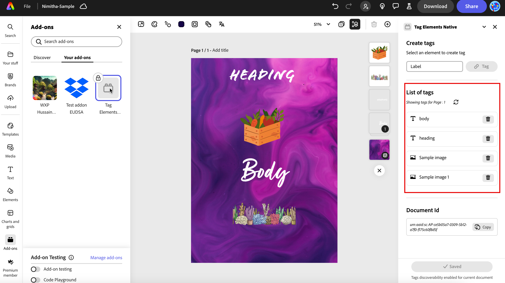

# Tag Elements in Your Documents

Tag elements in your Express documents to enable programmatic updates through the Express API.

## Overview

The Tag Elements Add-on lets you mark specific elements in your Adobe Express documents for API-driven updates. This guide shows you how to tag elements and use them in your automation workflows.

## Step 1: Install the Tag Elements Add-on

1. **Open Adobe Express**:

   - Navigate to [Adobe Express](https://new.express.adobe.com/) in your web browser.
  
2. **Install the Tag Elements Add-on**:

   - Open the [Tag Elements Add-on](https://adobesparkpost.app.link/TR9Mb7TXFLb?mode=private&claimCode=wjmj67nj9:PLYN7XLJ) URL.
   - Click the `ADD` button to install the add-on.
   - Once installed, the add-on will appear under the `Your add-ons` tab in the **Add-ons section**.

## Step 2: Create tags for a document

1. **Design your document**:

   Start by creating your document in [Adobe Express](https://new.express.adobe.com/). You can design it as needed, adding text, images, and other elements.
  
2. **Open the Tag Elements Add-on**:

   Access the [Tag Elements Add-on](https://adobesparkpost.app.link/TR9Mb7TXFLb?mode=private&claimCode=wjmj67nj9:PLYN7XLJ) by clicking on it from the `Your add-ons` tab.
  
3. **Select an element to tag**:

   Click on an element in your document that you want to tag (e.g., a text box, an image or a video). You can see the type of element selected in the left-hand panel header in Express.
  
4. **Tag the element**:

   - In the [Tag Elements Add-on](https://adobesparkpost.app.link/TR9Mb7TXFLb?mode=private&claimCode=wjmj67nj9:PLYN7XLJ), enter a tag name for the selected element in the input field.
   - Input your label into the text field.
   - Click the **Tag** button. The tag will now be listed below in the add-on.
   - Click the **Save changes** button.

5. **Repeat for other elements**:

   Repeat the tagging process for all other elements you want to enable for updating using the Express API.

   You can find the list of tags and their types in the right pane of the add-on.

   
  
6. **Save your document**:

   Once you have tagged all necessary elements, click the **Save changes** button to save your document.

<InlineAlert variant="warning" slots="text" />

Clicking **Save changes** is important for the document/element visibility while using [`/beta/tagged-documents`](../../api/alpha-tagged-documents/index.md).

## Use Case: Locking a template for consistent branding

Imagine you are creating a marketing template for your company. You want to ensure that certain elements, like the company logo and tagline, remain consistent across all documents. Here's how you can achieve that:

1. **Design your template**:

   - Create a template with your company's branding elements, such as the logo, tagline, and color scheme.
  
2. **Tag branding elements**:

   - Use the [Tag Elements Add-on](https://adobesparkpost.app.link/TR9Mb7TXFLb?mode=private&claimCode=wjmj67nj9:PLYN7XLJ) to tag the logo and tagline. For example, tag the logo as "company_logo" and the tagline as "company_tagline".
  
3. **Lock the template**:

   - Once you have tagged the necessary elements, save the template. This template can now be used as a locked design, ensuring that the tagged elements remain consistent.
  
4. **Use the template in API workflows**:

   - In your Express API-enabled workflow, reference the tags "company_logo" and "company_tagline" to programmatically swap out these elements if needed, while keeping the overall design consistent.

## Additional Information

- **Tagging elements**:

  - The Tag Elements add-on allows you to tag elements across pages in your Express document. These tags can be used for quick and easy replacement via an Express API-enabled workflow.
  - You can tag as many elements as required in your replacement workflow.
  - Tag names must be unique within a single page, but the same tag name can be used for distinct elements on different pages. All tags with the same name will be swapped out with the same element in any replacement flow.
  
- **Viewing tagged elements**:

  - As you tag elements on a page, they will appear in the right pane list of the add-on. This list refreshes as you navigate through the pages of your document.
  
- **Using tags in API workflows**:
  
  - Once you have completed tagging, these tags can be referenced in your Express API-enabled workflow to programmatically swap out elements in seconds.

You've now learned how to use the [Tag Elements Add-on](https://adobesparkpost.app.link/TR9Mb7TXFLb?mode=private&claimCode=wjmj67nj9:PLYN7XLJ) in [Adobe Express](https://new.express.adobe.com/) to tag elements and a use case example for creating a locked template to enable consistent branding. With this knowledge and the Express API, you can streamline your design workflow and maintain a professional and cohesive look across all your documents. Happy designing!
