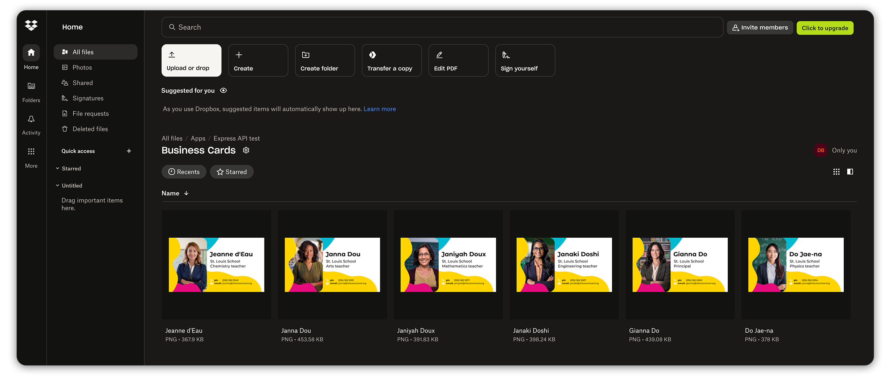
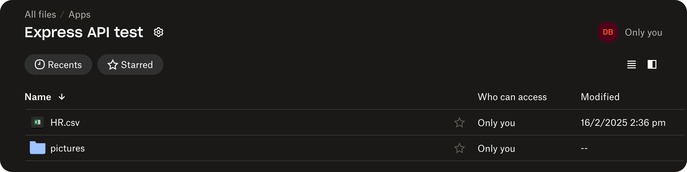
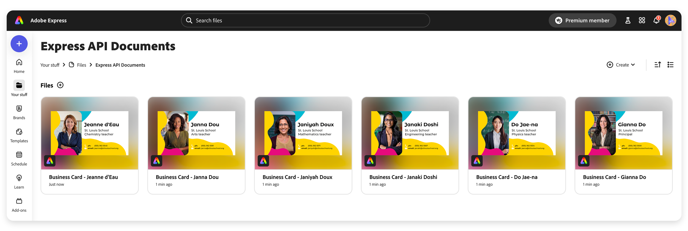
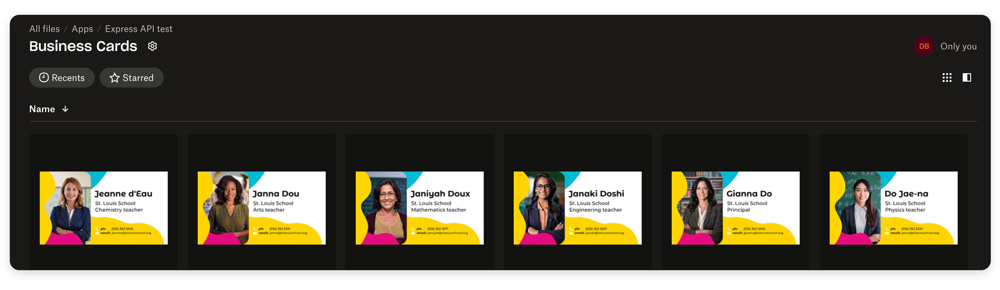

# Creating a Dropbox Integration Workflow

Learn how to use the Adobe Express API to automate the creation of business cards using a Dropbox assets integration.

## Overview

In this tutorial, we'll create an automated workflow for generating business cards for teachers at a small school. We'll use the Adobe Express API to create personalized business cards from a template, integrating with Dropbox to manage assets and store the final results.

The workflow will:

- Read teacher data from a CSV file stored in Dropbox
- Access profile pictures from a Dropbox folder
- Generate personalized business cards using an Adobe Express template
- Save the completed cards back to Dropbox



This tutorial combines several key concepts from the How-to section, including:

- [Generating variations](../how-to/generate-variations.md)
- [Exporting renditions](../how-to/export-document.md)
- Tracking job statuses
- Dropbox API integration

## Prerequisites

This tutorial assumes you have:

- Access to the [Adobe Express API](../concepts/authentication/index.md), and know how to generate an API key and authorization token.
- Familiarity with [Template tagging](../how-to/tag-documents.md), and the [Tag Elements Add-on](../index.md#overview).
- Node.js installed on your machine (version 18 or later would be better).

## Step 1: Creating a tagged template

First thing, our school's Art teacher will have created a beautiful business card template in Adobe Express. Using the [Tag Elements Add-on](../index.md#overview), we must tag elements that our automation script will later update. In our case, we'll tag Text nodes for the teacher's Name, Role, Email, Phone, and one Image node as their profile picture.


Select each node, type the tag name, and don't forget to click the **Save** button on the add-on's footer to persist the changes!

Copy the **DocumentId** (the string starting with `urn:`), which will be used later in the script to identify the template.

## Step 2: Collecting the data

We'll create a **CSV file** with all the teachers' data, including their Name, Role, Email, Phone, and a link to their profile picture in Dropbox. Name it `HR.csv`, it should look like this.

```csv
Name;Role;Phone;Email;Picture
Gianna Do;Principal;(555) 362 5500;gianna@stlouisschool.org;Gianna Do
Do Jae-na;Physics teacher;(555) 362 5534;jaena@stlouisschool.org;Do Jae-na
Janaki Doshi;Engineering teacher;(555) 362 5567;janaki@stlouisschool.org;Janaki Doshi
Janiyah Doux;Mathematics teacher;(555) 362 5571;janiyah@stlouisschool.org;Janiyah Doux
Janna Dou;Arts teacher;(555) 362 5591;janna@stlouisschool.org;Janna Dou
Jeanne d'Eau;Chemistry teacher;(555) 362 5545;jeanne@stlouisschool.org;Jeanne d'Eau
```

We also need to have all the profile pictures for each teacher. For this tutorial, we've created them using [Adobe Firefly](https://new.express.adobe.com/generate-image/inspire)—no teacher has been bothered in the process!


Let's keep the CSV and the profile pictures handy for the next step.

## Step 3: Creating a Dropbox App

In order to interact with the [Dropbox API](https://www.dropbox.com/developers), we need to create an App and generate an Access Token. From the [Developers Documentation](https://www.dropbox.com/developers/documentation), select [App Console](https://www.dropbox.com/developers/apps) and click on **Create app**. Select the following options:

1. Choose an API: **Scoped access**.
2. Choose the type of access you need: **App folder** (access to a single folder created specifically for your app)
3. Name your app: **Express API test** will make do.

Click again the **Create app** at the bottom of the page to confirm. In the **Permissions** tab, ensure to check the following options of the **Files and folders** section:

- ✅ `files.metadata.write`
- ✅ `files.metadata.read`
- ✅ `files.content.write`
- ✅ `files.content.read`

Remember to click **Submit** to save the changes!

Back in the **Settings** tab, click on the **Generate** button in the **OAuth 2** section to create an Access Token. Save this token, as we'll use it in the next step.

Please also note the **App folder name** (in our case, `Express API test`), because it's the only folder our app will be able to access in our Dropbox account. I've put the CSV and the JPG files in a `Apps/Express API test/pictures` folder there, so we're all set!



## Step 4: Scaffolding the Script

Our project folder should, eventually, look like this:

```txt
.
├── package-lock.json
├── package.json          📦 dependencies: dotenv dropbox papaparse
├── node_modules
│   └── ...
├── .env                  🌍 Environment variables
├── index.js              📝 Main script
├── utils
│   └── helpers.js        🛠️ Utility functions
└── services
    ├── dropbox.js        📡 Dropbox API functions
    └── express-api.js    📡 Express API functions
```

<InlineAlert variant="info" slots="text1" />

If you know what you're doing, you can skim this section—see you in the next one! Otherwise, we'll guide you step-by-step through the process of setting up the project.

Create a new Folder, and inside it, run `npm init -y` to create a `package.json` file. Install the necessary dependencies:

```sh
npm install dotenv dropbox papaparse
```

Please note, if you're using Node.js v16 or earlier, you would need to additionally install `node-fetch` to make HTTP requests (from v18 ). A short explanation of the packages:

- `dotenv`: To load environment variables from a `.env` file.
- `dropbox`: Official Dropbox SDK for JavaScript.
- `papaparse`: CSV file parser for JavaScript.

`package.json` needs to have a couple of new properties: a **type** to allow the use of JavaScript modules (the `import` syntax) and a **start** script that runs the whole show.

<CodeBlock slots="heading, code" repeat="1" languages="JSON" />

#### package.json

```json
{
  "name": "tutorial-node-express-api",
  "version": "1.0.0",
  "type": "module", // 👈 allows the use of JS modules (import syntax)
  "description": "Sample code for a Node-based Express API tutorial",
  "main": "index.js",
  "scripts": {
    "test": "echo \"Error: no test specified\" && exit 1",
    "start": "node index.js" // 👈 to run the script
  },
  "author": "Davide Barranca",
  "license": "ISC",
  "dependencies": {
    "dotenv": "^16.4.7",
    "dropbox": "^10.34.0",
    "papaparse": "^5.5.2"
  }
}
```

Create a `.env` file in the project's with the following content:

<CodeBlock slots="heading, code" repeat="1" languages="bash" />

#### .env

```sh
EXPRESS_API_KEY="your_express_api_key"
EXPRESS_API_TOKEN="your_very_long_express_api_token_here"
DROPBOX_ACCESS_TOKEN="your_very_long_dropbox_access_token_here"
```

Last but not least, create an `index.js` file in the project's root folder, where we'll write the script. Add the following code as a starter:

<CodeBlock slots="heading, code" repeat="1" languages="javascript" />

#### index.js

```js
async function main() {
  try {
    console.log("Main function starting...");
  } catch (error) {
    console.error("Ouch!", error);
  }
}

main();
```

If you run `npm start` in the terminal, you should see the log message printed in the console. If you don't, please go back and check you've followed all the steps correctly; otherwise, you're good to go!

## Step 5: Creating Utility Functions

We'll create a set of utility functions in a `utils/helpers.js` file that will be used throughout the application:

- `sleep()`: creates a delay in the code—useful for waiting between API calls.
- `verifyTemplateTags()`: Checks if a template has all the required tags; this ensures that our template can be used for generating variations.
- `checkExpressJobs()` and `checkDropboxJobs()`: Check the status of multiple Express API or Dropbox jobs in parallel; this is used to monitor the progress of variation and export jobs.

<InlineAlert variant="info" slots="text1" />

To keep the page lean, we'll skip the implementation of the some of the functions in the following sections. You can find the complete code, thoroughly commented at [the end of this tutorial](#complete-example).

<CodeBlock slots="heading, code" repeat="1" languages="javascript" />

#### utils/helpers.js

```js
/**
 * Creates a promise that resolves after the specified time
 * Used to introduce delays in the code for waiting between API calls
 *
 * @param {number} ms - Time to sleep in milliseconds
 */
export const sleep = (ms) => new Promise((resolve) => setTimeout(resolve, ms));

/**
 * Verifies that a template has all required tags
 * This is important to ensure the template can be used for generating variations
 *
 * @param {Object} tagDetails - The tag details object from the Express API
 * @param {Array<string>} requiredTags - Array of required tag names
 * @returns {Array<string>} Array of tag names found in the template
 * @throws {Error} If no tagged elements are found or if a required tag is missing
 */
export const verifyTemplateTags = (tagDetails, requiredTags) => {
  /* ... */
};

/**
 * Checks the status of multiple Express API jobs
 * This function allows checking multiple job statuses in parallel
 *
 * @param {Array} jobIds - Array of job IDs to check
 * @param {Function} getStatusFn - Function to get job status
 * @returns {Promise<Array>} Array of job status objects
 *
 * @example
 * // Check status of variation jobs
 * const statuses = await checkExpressJobs(variationJobIds, getExpressStatus);
 */
export const checkExpressJobs = async (jobIds, getStatusFn) => {
  /* ... */
};

/**
 * Checks the status of multiple Dropbox jobs
 * This function enhances job status objects with helpful flags
 *
 * @param {Array} dropboxJobs - Array of objects containing asyncJobId and teacherName
 * @param {Function} checkStatusFn - Function to check job status
 * @returns {Promise<Array>} Array of job status objects with original job info
 *
 * @example
 * // Check status of Dropbox upload jobs
 * const jobStatuses = await checkDropboxJobs(asyncJobs, checkDropboxStatus);
 *
 * // Use the helpful flags
 * const completedJobs = jobStatuses.filter(job => job.isComplete);
 * const failedJobs = jobStatuses.filter(job => job.isFailed);
 * const inProgressJobs = jobStatuses.filter(job => job.isInProgress);
 */
export const checkDropboxJobs = async (dropboxJobs, checkStatusFn) => {
  /* ... */
};
```

## Step 6: Fetching the CSV and Profile Pictures

We'll start by fetching the CSV file from Dropbox and parsing it to get the teachers' data. Create a new file `services/dropbox.js`; in this file, we first use the `dotenv` package to load the environment variables from the `.env` file. We then create a new instance of the Dropbox SDK, passing the Access Token as a configuration option. We define three functions:

- `listDropboxFiles()`: [Fetch a list of files](https://dropbox.github.io/dropbox-sdk-js/Dropbox.html#filesListFolder__anchor) in a Dropbox folder.
- `getPreSignedUrl()`: [Fetch a pre-signed URL](https://dropbox.github.io/dropbox-sdk-js/Dropbox.html#filesGetTemporaryLink__anchor) for a file in Dropbox.
- `readCsvFile()`: Read a CSV file from Dropbox, [parses it](https://www.papaparse.com/docs#strings) using the `papaparse` library, and returns an array of objects.

These functions are enough to fetch the CSV file and the profile pictures. Later, we'll need more functions to interact with the Dropbox API:

- `createFolder()`: [Create a new folder](https://dropbox.github.io/dropbox-sdk-js/Dropbox.html#filesCreateFolderV2__anchor) in Dropbox.
- `saveUrlToDropbox()`: [Save a URL](https://dropbox.github.io/dropbox-sdk-js/Dropbox.html#filesSaveUrl__anchor) to Dropbox (the fetching happens on Dropbox's servers).
- `checkDropboxStatus()`: [Check the status](https://dropbox.github.io/dropbox-sdk-js/Dropbox.html#filesSaveUrlCheckJobStatus__anchor) of an async Dropbox job.
- `downloadAndUploadFile()`: [Alternative upload method](https://dropbox.github.io/dropbox-sdk-js/Dropbox.html#filesUpload__anchor) (the fetching happens on the local machine).

<InlineAlert variant="info" slots="text1" />

As said before, check out the implementation of the functions in the [complete example](#complete-example).

<CodeBlock slots="heading, code" repeat="1" languages="javascript" />

#### services/dropbox.js

```js
import dotenv from "dotenv";
import { Dropbox } from "dropbox";
import Papa from "papaparse";

dotenv.config(); // loads .env
const dbx = new Dropbox({ accessToken: process.env.DROPBOX_ACCESS_TOKEN });

/**
 * Lists files and folders in a Dropbox directory
 *
 * @param {string} path - The path to list contents of
 * @returns {Promise<Array|undefined>} Array of file and folder entries or undefined on error
 */
export async function listDropboxFiles(path = "") {
  /* ... */
}

/**
 * Gets a pre-signed URL for a file in Dropbox
 * This is useful for accessing files temporarily without authentication
 *
 * @param {string} path - The path to the file in Dropbox
 * @returns {Promise<string|undefined>} The pre-signed URL or undefined on error
 */
export async function getPreSignedUrl(path) {
  /* ... */
}

/**
 * Creates a folder at the specified path in Dropbox
 * If the folder already exists, it returns success
 *
 * @param {string} path - The path where the folder should be created
 * @returns {Promise<Object>} The result of the folder creation
 */
export async function createFolder(path) {
  /* ... */
}

/**
 * Reads a CSV file from Dropbox and parses it into an array of objects
 * Used in index.js to read teacher data from HR.csv
 *
 * @param {string} path - The path to the CSV file in Dropbox
 * @returns {Promise<Array<Object>|undefined>} Array of objects representing CSV rows, or undefined on error
 */
export async function readCsvFile(path) {
  /* ... */
}

/**
 * Saves a URL to Dropbox
 * This initiates a server-side download of the URL content to Dropbox
 *
 * @param {string} url - The URL to download
 * @param {string} path - The path where to save the file in Dropbox
 * @returns {Promise<Object>} The result, which may contain an async job ID
 */
export async function saveUrlToDropbox(url, path) {
  /* ... */
}

/**
 * Checks the status of an async Dropbox job
 * Used to monitor the progress of saveUrlToDropbox operations
 *
 * @param {string} asyncJobId - The ID of the async job to check
 * @returns {Promise<Object>} The job status
 */
export async function checkDropboxStatus(asyncJobId) {
  /* ... */
}

/**
 * Alternative upload method that downloads a file and uploads it directly to Dropbox
 * This avoids using the async saveUrlToDropbox method and provides more direct control
 * Used in index.js as a fallback when saveUrlToDropbox is not suitable
 */
export async function downloadAndUploadFile(url, dropboxPath) {
  /* ... */
}
```

This will be enough for the moment to fetch the CSV file and the profile pictures. Let's test it in the `index.js` file:

<CodeBlock slots="heading, code" repeat="1" languages="javascript" />

#### index.js

```js
import { listDropboxFiles, readCsvFile } from "./services/dropbox.js";
async function main() {
  try {
    // Fetch + log the CSV file with the teachers' data          👈
    const teachers = await readCsvFile("/HR.csv");
    console.log(teachers);

    // Fetch + log the list of files in the /pictures folder     👈
    const dropboxPictures = await listDropboxFiles("/pictures");
    console.log(dropboxPictures);
  } catch (error) {
    console.error("Ouch!", error);
  }
}

main();
```

If you run `npm start` in the terminal now, you should see the list of teachers' data and the list of files in the `/pictures` folder printed in the console.

```sh
[
  {
    Name: 'Gianna Do',
    Role: 'Principal',
    Phone: '(555) 362 5500',
    Email: 'gianna@stlouisschool.org',
    Picture: 'Gianna Do'
  },
  ...
]
[
  {
    '.tag': 'file',
    name: 'Gianna Do.jpg',
    path_lower: '/pictures/gianna do.jpg',
    path_display: '/pictures/Gianna Do.jpg',
    id: 'id:nHTfZWop868AAAAAAAAADA',
    client_modified: '2025-02-28T15:17:21Z',
    server_modified: '2025-02-28T15:17:22Z',
    rev: '0162f354d9cd6a000000002db3c86a1',
    size: 769104,
    is_downloadable: true,
    content_hash: '85f73ceb15dfda2dc4f4c1b2fc7f07ab4612ec1057170f4e387200c3188d4e35'
  },
  ...
]
```

If this is not the case, please double-check the code, and the presence of the `HR.csv` file on the Dropbox.

## Step 7: Fetching the Template

Now that we have the teachers' data and know how to fetch the profile pictures, we can move on to fetching the tagged template from Adobe Express and generating variations for each teacher. Create a new file `services/express-api.js`. This file contains the functions to interact with the Adobe Express API.

- `retrieveTagDetails()`: Fetch the **list of tags** in a template. Useful to check the tags' names and types.
- `generateVariations()`: **Generate variations** for a template. We'll use this to populate the template's tags with custom data from the CSV.
- `exportRendition()`: **Export the rendition** of a template. We'll use this to save the business cards as PNG images (PDF is also supported if you prefer print-ready output).
- `getExpressStatus()`: Get the **status of a job**. We'll use this to track the progress of both the generation and export jobs.

<InlineAlert variant="info" slots="text1" />

The functions are mostly wrappers around the [API endpoints](../../api/index.md), using `fetch` to make HTTP requests. Check out the implementation in the [complete example](#complete-example).

<CodeBlock slots="heading, code" repeat="1" languages="javascript" />

#### services/express-api.js

```js
import dotenv from "dotenv";
dotenv.config();

// Uncomment this line if you're using Node.js v16 or earlier
// import fetch from "node-fetch";

const API_KEY = process.env.EXPRESS_API_KEY || "";
const EXPRESS_API_TOKEN = process.env.EXPRESS_API_TOKEN;
const EXPRESS_ENDPOINT = "https://express-api.adobe.io";

const headers = {
  "X-API-KEY": API_KEY,
  Authorization: `Bearer ${EXPRESS_API_TOKEN}`,
  "Content-Type": "application/json", // often needed for POST requests
};

/**
 * Gets the status of an Express API job
 * Used to monitor the progress of variation and export jobs
 *
 * @param {string} jobId - The ID of the job to check
 * @returns {Promise<Object>} The job status object
 */
export async function getExpressStatus(jobId) {
  /* ... */
}

/**
 * Exports a rendition of a document
 * This creates a downloadable version of the document
 *
 * @param {Object} requestBody - The export request parameters
 * @param {string} requestBody.id - The document ID to export
 * @param {string} requestBody.pages - The pages to export (e.g., "1")
 * @param {Object} requestBody.options - Export options like format and size (or PDF settings)
 * @returns {Promise<Object>} The export job information
 */
export async function exportRendition(requestBody) {
  /* ... */
}

/**
 * Generates variations of a document using tag mappings
 * This creates a new document with the specified tag values
 *
 * @param {Object} requestBody - The variation request parameters
 * @param {string} requestBody.id - The template document ID
 * @param {Object} requestBody.variationDetails - Details for the variation
 * @param {Object} requestBody.variationDetails.tagMappings - Values for each tag
 * @param {String} requestBody.variationDetails.pages - The pages to export (e.g., "1")
 * @param {String} requestBody.variationDetails.preferredDocumentName - The name of the document to save
 * @returns {Promise<Object>} The variation job information
 */
export async function generateVariations(requestBody) {
  /* ... */
}

/**
 * Retrieves tag details for a document
 * Used to verify that a template has the required tags
 *
 * @param {string} documentId - The ID of the document to check
 * @param {Object} queryParams - Additional query parameters
 * @returns {Promise<Object>} The document tag details
 */
export async function retrieveTagDetails(
  documentId,
  queryParams = { start: "1" }
) {
  /* ... */
}
```

Let's now **fetch the tagged template** in the `index.js` file. We'll write some code to retrieve the tags and check that the template contains them all.

<CodeBlock slots="heading, code" repeat="1" languages="javascript" />

#### index.js

```js
import { readCsvFile } from "./services/dropbox.js";
import { retrieveTagDetails } from "./services/express-api.js";
import { verifyTemplateTags } from "./utils/helpers.js";

// Constants for easier reference
const DOCUMENT_ID = "urn:aaid:sc:EU:cd9a3037-6583-56c4-b3e9-f393d95d43b9";
const TAGS = ["Picture", "Name", "Role", "Phone", "Email"];

async function main() {
  try {
    // STEP 1: Read teacher data from CSV file in Dropbox
    // ...
    // STEP 2: Verify that the Express template has all required tags
    console.log("Retrieving tag details from Express API:");
    const tagDetails = await retrieveTagDetails(DOCUMENT_ID);

    // Use the utility function to verify template tags
    const taggedElements = verifyTemplateTags(tagDetails, TAGS);
    console.log("Tagged elements are OK:", taggedElements);
  } catch (error) {
    console.error("Ouch!", error);
  }
}
```

Running `npm start` should now fetch the tagged template and check that it contains all the required tags. If everything is in order, you should see the following log message:

```txt
Reading CSV file from Dropbox /HR.csv:
Found 6 records in CSV file
Retrieving tag details from Express API:
Tagged elements are OK: [ 'Picture', 'Name', 'Role', 'Phone', 'Email' ]
```

## Step 8: Generating Variations

Now that we have the teachers' data, the profile pictures, and the tagged template, we can move on to generating variations for each teacher. We'll use the `generateVariations()` function from the `express-api.js` file to populate the template's tags with the teachers' data. The function takes our template ID and a variationDetails object that includes:

- **Which page** to modify (in our case, just page `"1"`)
- A **preferred name** for the new document
- Most importantly, the **`tagMappings` object** that maps our template tags to the teacher's data

<CodeBlock slots="heading, code" repeat="1" languages="javascript" />

#### index.js

```js
import { readCsvFile, getPreSignedUrl } from "./services/dropbox.js";
import {
  getExpressStatus,
  generateVariations,
  retrieveTagDetails,
} from "./services/express-api.js";
import {
  sleep,
  verifyTemplateTags,
  checkExpressJobs,
} from "./utils/helpers.js";

// Configuration
const DOCUMENT_ID = "urn:aaid:sc:EU:6e1f27db-4202-543d-83d8-2b9583a3865e";
const TAGS = ["Picture", "Name", "Role", "Phone", "Email"];

// Configuration for Dropbox API methods
const STATUS_CHECK_INTERVAL = 3000; // Time between status checks in milliseconds

async function main() {
  try {
    // STEP 1: Read teacher data from CSV file in Dropbox
    // ...
    // STEP 2: Verify that the Express template has all required tags
    // ...
    // STEP 3: Generate variations for each teacher
    console.log("Generating variations for each teacher...");
    let variationJobIds = [];
    let teacherNames = []; // Store names to use for file naming later

    // Iterate over the teachers and generate a variation for each one
    for (const teacher of teachers) {
      const { Name, Role, Phone, Email, Picture } = teacher;
      teacherNames.push(Name);

      // Get the teacher's profile picture
      const pictureURL = await getPreSignedUrl(`/pictures/${Picture}.jpg`);

      const variationResponse = await generateVariations({
        id: DOCUMENT_ID,
        variationDetails: {
          pages: "1",
          preferredDocumentName: `Business Card - ${Name}`,
          tagMappings: {
            Picture: pictureURL,
            Name,
            Role,
            Phone,
            Email,
          },
        },
      });

      // Collect the Job ID
      variationJobIds.push(variationResponse.jobId);
      console.log(
        `Submitted variation job for ${Name}, job ID: ${variationResponse.jobId}`
      );
    }
  } catch (error) {
    console.error("Error in main():", error);
  }
}
```

<InlineAlert variant="warning" slots="header, text1" />

Beware of forEach

The `forEach` method doesn't work well with `async` functions. If you need to use `await`, you should use a `for...of` loop instead.

After the variations are generated, we need to wait for them to complete. We'll use the `checkExpressJobs()` function from the `helpers.js` file to check the status of the jobs.

<CodeBlock slots="heading, code" repeat="1" languages="javascript" />

#### index.js

```js
// ...
async function main() {
  try {
    // STEP 1: Read teacher data from CSV file in Dropbox
    // ...
    // STEP 2: Verify that the Express template has all required tags
    // ...
    // STEP 3: Generate variations for each teacher
    // ...
    // STEP 4: Wait for all variation jobs to complete
    console.log("Checking variation job statuses...");
    let generationStatuses = await checkExpressJobs(
      variationJobIds,
      getExpressStatus
    );
    let runningCount = generationStatuses.filter(
      ({ status }) => status === "running"
    ).length;

    while (runningCount > 0) {
      console.log(`Waiting for ${runningCount} variation jobs to complete...`);
      await sleep(STATUS_CHECK_INTERVAL);
      generationStatuses = await checkExpressJobs(
        variationJobIds,
        getExpressStatus
      );
      runningCount = generationStatuses.filter(
        ({ status }) => status === "running"
      ).length;
    }

    console.log("All variation jobs completed!");

    // Check for any failed jobs
    const failedJobs = generationStatuses.filter(
      ({ status }) => status !== "succeeded"
    );
    if (failedJobs.length > 0) {
      console.warn(
        `Warning: ${failedJobs.length} variation jobs failed:`,
        failedJobs.map((status) => status.jobId)
      );
    }
  } catch (error) {
    console.error("Error in main():", error);
  }
}
```

The Express API processes our variation requests asynchronously, so we need to wait for all jobs to complete before proceeding. This is where our utility function `checkExpressJobs()` comes in handy. We use a polling approach to check the status of all jobs periodically:

- First, we **check the initial status** of all jobs using `checkExpressJobs()`
- We count how many jobs are **still running**
- If any jobs are still running, we **wait for a short interval** (defined by `STATUS_CHECK_INTERVAL`)
- We **check again and repeat** until all jobs are completed

Running `npm start` should now generate a variation for each teacher and log the Job IDs for each one. If everything is working correctly, you should see a list of Job IDs in the console.

```txt
...
Generating variations for each teacher...
Submitted variation job for Gianna Do, job ID: fff346f9-0770-44ba-9889-d6f6e31fb3e0
Submitted variation job for Do Jae-na, job ID: 60c3544e-83f0-4f10-9a07-5733bd85053d
Submitted variation job for Janaki Doshi, job ID: ca06a17e-c42a-4032-8552-bf2e3e8e2d61
Submitted variation job for Janiyah Doux, job ID: f9a9013d-7907-4e3b-961a-e295c2d2a036
Submitted variation job for Janna Dou, job ID: d6f0de24-31a4-461a-8505-3c0b8362a3cc
Submitted variation job for Jeanne d'Eau, job ID: 918e870b-66a4-4153-b02e-798109633aa4
Checking variation job statuses...
Waiting for 5 variation jobs to complete...
Waiting for 3 variation jobs to complete...
Waiting for 1 variation jobs to complete...
All variation jobs completed!
✨  Done in 26.23s.
```

## Step 9: Exporting Renditions

After successfully generating variations for each teacher, we need to export these documents as PNG images that can be shared or printed. The Export Rendition API also supports PDF output (standard or print) if you want press-ready files. The code in this section handles the export process in several steps:

```javascript
// ...
async function main() {
  try {
    // STEP 1: Read teacher data from CSV file in Dropbox
    // ...
    // STEP 2: Verify that the Express template has all required tags
    // ...
    // STEP 3: Generate variations for each teacher
    // ...
    // STEP 4: Wait for all variation jobs to complete
    // ...
    // STEP 5: Export renditions for successful variations
    let exportationJobIds = [];
    let documentIds = []; // Store document IDs to match with teacher names

    console.log("Starting export jobs for successful variations...");
    for (let i = 0; i < generationStatuses.length; i++) {
      const status = generationStatuses[i];
      if (status.status !== "succeeded") {
        console.error(`Generation job failed for ${teacherNames[i]}:`, status);
        continue;
      }

      const exportResponse = await exportRendition({
        id: status.document.id,
        pages: "1",
        options: {
          format: "image/png",
          size: 1000,
          // For PDFs, use format: "application/pdf" and add options like:
          // pdfType: "standard" | "print",
          // downloadIndividualPdfFiles: true | false,
          // config: { accessibilityTags: true, bleed: true, cropMargins: true, ... }
        },
      });

      exportationJobIds.push(exportResponse.jobId);
      documentIds.push({
        jobId: exportResponse.jobId,
        teacherName: teacherNames[i],
        documentId: status.document.id,
      });

      console.log(
        `Submitted export job for ${teacherNames[i]}, job ID: ${exportResponse.jobId}`
      );
    }
```

In this section, we:

- Create arrays to **track export job IDs** and document information
- **Loop through each generation** status (from our previous step)
- **Skip any failed generation jobs**
- For successful generations, **call `exportRendition()`** with:
  - The **document ID** from the generation step
  - The **page number** to export (just page "1" in our case)
  - **Export options** specifying PNG format and a size of 1000 pixels
- **Store the export job ID** and document information for later use
- **Log a message** for each submitted export job

The `exportRendition()` function is another asynchronous operation that returns a job ID. We need to track these jobs to know when the exports are complete. Just like with the variation generation, we need to wait for all export jobs to complete:

```javascript
// STEP 1: Read teacher data from CSV file in Dropbox
// ...
// STEP 2: Verify that the Express template has all required tags
// ...
// STEP 3: Generate variations for each teacher
// ...
// STEP 4: Wait for all variation jobs to complete
// ...
// STEP 5: Export renditions for successful variations
// ...
// STEP 6: Wait for all export jobs to complete
console.log("Checking export job statuses...");
let exportationStatuses = await checkExpressJobs(
  exportationJobIds,
  getExpressStatus
);
runningCount = exportationStatuses.filter(
  ({ status }) => status === "running"
).length;

while (runningCount > 0) {
  console.log(`Waiting for ${runningCount} export jobs to complete...`);
  await sleep(STATUS_CHECK_INTERVAL);
  exportationStatuses = await checkExpressJobs(
    exportationJobIds,
    getExpressStatus
  );
  runningCount = exportationStatuses.filter(
    ({ status }) => status === "running"
  ).length;
}

console.log("All export jobs completed!");
const failedExports = exportationStatuses.filter(
  ({ status }) => status !== "succeeded"
);
if (failedExports.length > 0) {
  console.warn(
    `Warning: ${failedExports.length} export jobs failed:`,
    failedExports.map((status) => status.jobId)
  );
}
```

This code follows the same polling pattern we used for variation jobs:

- **Check the status** of all export jobs
- Count **how many are still running**
- If any are running, **wait for a short interval and check again**
- **Repeat** until all jobs are complete
- We also check for any **failed export jobs** and log a warning if necessary.

Once all export jobs are complete, we need to **collect the URLs of the exported renditions**:

```javascript
// STEP 7: Get rendition URLs for successful exports
const renditionUrls = [];
for (let i = 0; i < exportationStatuses.length; i++) {
  const status = exportationStatuses[i];
  if (
    status.status === "succeeded" &&
    status.pageRenditionsResult &&
    status.pageRenditionsResult.length > 0
  ) {
    const teacherInfo = documentIds.find((doc) => doc.jobId === status.jobId);
    renditionUrls.push({
      url: status.pageRenditionsResult[0].renditionUrl,
      teacherName: teacherInfo ? teacherInfo.teacherName : `unknown-${i}`,
      jobId: status.jobId,
    });
  }
}

console.log(`Got ${renditionUrls.length} rendition URLs to upload to Dropbox`);
```

In this section, we:

1. **Create an array to store rendition URLs** and associated teacher information
2. **Loop through each export** status
3. For successful exports with available rendition results, **find the matching teacher** information
4. **Store the rendition URL**, teacher name, and job ID in our array
5. **Log the number of rendition URLs** we've collected

These rendition URLs are links to the exported PNG images (or PDFs if you choose `application/pdf`). In the next step, we'll use these URLs to download the files and upload them to Dropbox.

## Step 10: Uploading to Dropbox

Now that we have successfully exported our business cards as PNG images, the final step is to upload them to Dropbox so they can be easily accessed by our school staff. If you export PDFs instead, update the file extension accordingly.
Before we start uploading files to Dropbox, we need to take a few preparatory steps:

```javascript
// STEP 8: Wait before starting uploads to ensure URLs are ready
// This is just a precautionary measure!
console.log(
  `Waiting ${
    INITIAL_WAIT_TIME / 1000
  } seconds before starting uploads to ensure URLs are fully ready...`
);
await sleep(INITIAL_WAIT_TIME);
console.log("Wait complete, starting upload process...");

// STEP 9: Create Dropbox folder for uploads if it doesn't exist
try {
  console.log(`Ensuring output folder exists: ${OUTPUT_FOLDER}`);
  const folderResult = await createFolder(OUTPUT_FOLDER);
  console.log(
    `Folder created or already exists at: ${folderResult.path_lower}`
  );
} catch (error) {
  console.warn(`Warning: Could not create output folder: ${error.message}`);
  // Continue anyway
}
```

In this section, we:

1. **Wait for a short period** (defined by `INITIAL_WAIT_TIME`) as a precautionary measure to ensure that the URLs we received from the Express API are fully ready to be accessed.
2. **Create a dedicated folder** in Dropbox to store our business cards if it doesn't already exist

Now we can start **uploading the renditions** to Dropbox:

```javascript
// STEP 10: Upload renditions to Dropbox
console.log("Uploading renditions to Dropbox...");
console.log(`Total renditions to upload: ${renditionUrls.length}`);

const uploadPromises = renditionUrls.map(async (rendition) => {
  const { url, teacherName } = rendition;
  const dropboxPath = `${OUTPUT_FOLDER}/${teacherName}.png`;

  try {
    console.log(`Starting upload for ${teacherName}...`);
    const saveResult = await saveUrlToDropbox(url, dropboxPath);
    console.log(
      `Upload initiated for ${teacherName}, result type: ${
        saveResult[".tag"] || "unknown"
      }`
    );
    return {
      teacherName,
      path: dropboxPath,
      result: saveResult,
      jobId: rendition.jobId,
      url: rendition.url,
    };
  } catch (error) {
    console.error(
      `Failed to upload ${teacherName}'s business card:`,
      error.message || error
    );
    return {
      teacherName,
      error,
      jobId: rendition.jobId,
      url: rendition.url,
    };
  }
});

const allInitialResults = await Promise.all(uploadPromises);
```

In this section, we:

1. **Create an array of upload promises**, one for each rendition
2. For each rendition:
   - **Extract the URL** and teacher name and construct the full path in Dropbox where the file will be saved
   - **Call the `saveUrlToDropbox()` function** to initiate the upload
   - Return an object with information about the upload
3. **Handle any errors** that might occur during the upload process
4. **Wait for all upload promises to resolve** with `Promise.all()`

The `saveUrlToDropbox()` function is a wrapper around the Dropbox API's `saveUrl` method, which allows us to save a file from a URL directly to Dropbox without having to download it first—the fetching happens on Dropbox's servers. This is more efficient than downloading the file to our local machine and then uploading it to Dropbox.

Dropbox's `saveUrl` operation is asynchronous, meaning it returns immediately with a job ID while the actual upload happens in the background. We need to monitor these jobs to know when they're complete:

```javascript
// STEP 11: Monitor async Dropbox jobs until completion
// Filter out async jobs that need to be monitored
let asyncJobs = [];
for (const result of allInitialResults) {
  if (
    result.result &&
    typeof result.result === "object" &&
    ".tag" in result.result &&
    result.result[".tag"] === "async_job_id" &&
    "async_job_id" in result.result
  ) {
    asyncJobs.push({
      asyncJobId: result.result.async_job_id,
      teacherName: result.teacherName,
      path: result.path,
      originalJobId: result.jobId,
      url: result.url,
      retryCount: 0,
    });
  }
}

if (asyncJobs.length > 0) {
  console.log(`Monitoring ${asyncJobs.length} async Dropbox upload jobs...`);

  // Using the simplified checkDropboxJobs function for job monitoring
  let allJobsComplete = false;
  let retryCount = 0;

  while (!allJobsComplete && retryCount < MAX_RETRIES) {
    // Check all job statuses at once
    const jobStatuses = await checkDropboxJobs(asyncJobs, checkDropboxStatus);

    // Log the current status of each job
    jobStatuses.forEach((job) => {
      console.log(
        `Job for ${job.teacherName}: ${
          job.isComplete ? "Complete" : job.isFailed ? "Failed" : "In Progress"
        }`
      );
    });

    // Check if any jobs are still in progress
    const inProgressJobs = jobStatuses.filter((job) => job.isInProgress);

    if (inProgressJobs.length > 0) {
      console.log(
        `Still waiting for ${inProgressJobs.length} uploads to complete...`
      );
      // Wait before checking again
      await sleep(STATUS_CHECK_INTERVAL);
    } else {
      // All jobs are either complete or failed
      allJobsComplete = true;

      // Log the final results
      const successfulUploads = jobStatuses.filter((job) => job.isComplete);
      const failedUploads = jobStatuses.filter((job) => job.isFailed);

      console.log(
        `Upload results: ${successfulUploads.length} successful, ${failedUploads.length} failed`
      );

      if (failedUploads.length > 0 && retryCount < MAX_RETRIES - 1) {
        console.log(`Retrying ${failedUploads.length} failed uploads...`);
        retryCount++;

        // Update asyncJobs with only the failed jobs for retry
        asyncJobs = failedUploads.map((job) => ({
          ...job,
          retryCount: (job.retryCount || 0) + 1,
        }));

        allJobsComplete = false; // Continue the loop for retries
      } else if (failedUploads.length > 0) {
        console.warn(
          "Failed uploads after maximum retries:",
          failedUploads.map((job) => job.teacherName)
        );
      }
    }
  }
} else {
  console.log("No async jobs to monitor");
}
```

Here we:

1. **Create an array of async jobs** by filtering upload results for those with Dropbox async job IDs
2. For each job, **store tracking information** including teacher name, path, and retry count
3. Use `checkDropboxJobs()` to **monitor all job statuses** simultaneously
4. **Display each job's status** (Complete, Failed, or In Progress)
5. If jobs are still in progress, **wait and check again** after a delay
6. Once all jobs complete:
   - **Count** successful and failed uploads
   - For failed uploads, **retry** up to the maximum retry limit
   - When retrying, preserve job information but increment retry counts
   - After maximum retries, log a warning with the names of teachers whose uploads failed

<InlineAlert variant="warning" slots="header, text1" />

Fetching from the server or locally

Dropbox's `dbx.filesSaveUrl()`, which is the API call used internally by `saveUrlToDropbox()`, is sometimes finicky, and can result in failed uploads. Alternatively, we could download the file to our local machine and then upload it to Dropbox via `dbx.filesUpload()`—implemented in the `downloadAndUploadFile()` function; this is less efficient but it is more reliable. Hence, we'll use it as a fallback for the files that fail to upload using `saveUrlToDropbox()`.

```javascript
// STEP 11.5: Try alternative direct upload method for failed jobs
console.log(
  `Attempting direct upload method for ${failedUploads.length} failed jobs...`
);

const directUploadPromises = failedUploads.map(async (job) => {
  try {
    console.log(`Starting direct upload for ${job.teacherName}...`);
    const result = await downloadAndUploadFile(
      job.url,
      job.path || `${OUTPUT_FOLDER}/${job.teacherName}.png`
    );
    console.log(`Direct upload successful for ${job.teacherName}`);
    return {
      ...job,
      directUploadSuccess: true,
      directUploadResult: result,
    };
  } catch (error) {
    console.error(
      `Direct upload failed for ${job.teacherName}:`,
      error.message || error
    );
    return {
      ...job,
      directUploadSuccess: false,
      directUploadError: error,
    };
  }
});

const directUploadResults = await Promise.all(directUploadPromises);

// Log the results of direct uploads
const successfulDirectUploads = directUploadResults.filter(
  (job) => job.directUploadSuccess
);
console.log(
  `Direct upload results: ${successfulDirectUploads.length} successful, ${
    directUploadResults.length - successfulDirectUploads.length
  } failed`
);

if (successfulDirectUploads.length > 0) {
  console.log(
    `Successfully uploaded ${successfulDirectUploads.length} files using direct upload method`
  );
}

if (successfulDirectUploads.length < directUploadResults.length) {
  console.error(
    `Failed to upload ${
      directUploadResults.length - successfulDirectUploads.length
    } files even with direct upload method`
  );
}
```

In this section, we:

1. **Map over the failed uploads** and attempt to upload them again using the `downloadAndUploadFile()` function
2. **Log the results** of the direct uploads
3. If any uploads were successful, log the number of successful uploads
4. If any uploads failed, log the number of failed uploads
5. If all uploads failed, log a warning

## Complete example

Congratulations! You've now created a Node.js script that automates the creation of business cards for teachers using Adobe Express and Dropbox. On Adobe Express, you can see the result of the jobs (six new documents) in the "Your Stuff" section, "Files > Express API Documents".



On Dropbox, we let the script save the files in a "Business Cards" folder instead.



Here's the complete example for reference—check out all the tabs, which include `index.js`, `services/express.js`, `services/dropbox.js`, and `utils/helpers.js`.

<CodeBlock slots="heading, code" repeat="4" languages="index.js, services/express.js, services/dropbox.js, utils/helpers.js" />

#### index.js

```js
import {
  readCsvFile,
  getPreSignedUrl,
  saveUrlToDropbox,
  checkDropboxStatus,
  createFolder,
  downloadAndUploadFile,
} from "./services/dropbox.js";
import {
  getExpressStatus,
  exportRendition,
  generateVariations,
  retrieveTagDetails,
} from "./services/express-api.js";
import {
  sleep,
  verifyTemplateTags,
  checkExpressJobs,
  checkDropboxJobs,
} from "./utils/helpers.js";

// Configuration
const DOCUMENT_ID = "urn:aaid:sc:EU:6e1f27db-4202-543d-83d8-2b9583a3865e";
const TAGS = ["Picture", "Name", "Role", "Phone", "Email"];
const OUTPUT_FOLDER = "/Business Cards"; // Dropbox folder to save exported files

// Configuration for Dropbox API methods
const MAX_RETRIES = 3; // Number of retries for failed uploads
const STATUS_CHECK_INTERVAL = 3000; // Time between status checks in milliseconds
const INITIAL_WAIT_TIME = 10000; // Wait 5 seconds before starting Dropbox uploads

async function main() {
  try {
    // STEP 1: Read teacher data from CSV file in Dropbox
    console.log("Reading CSV file from Dropbox /HR.csv:");
    const teachers = await readCsvFile("/HR.csv");

    if (!teachers || !Array.isArray(teachers)) {
      throw new Error("Failed to read teachers from CSV or invalid format");
    }

    console.log(`Found ${teachers.length} records in CSV file`);

    // STEP 2: Verify that the Express template has all required tags
    console.log("Retrieving tag details from Express API:");
    const tagDetails = await retrieveTagDetails(DOCUMENT_ID);

    // Use the utility function to verify template tags
    const taggedElements = verifyTemplateTags(tagDetails, TAGS);
    console.log("Tagged elements are OK:", taggedElements);

    // STEP 3: Generate variations for each teacher
    console.log("Generating variations for each teacher...");
    let variationJobIds = [];
    let teacherNames = []; // Store names to use for file naming later

    // Iterate over the teachers and generate a variation for each one
    for (const teacher of teachers) {
      const { Name, Role, Phone, Email, Picture } = teacher;
      teacherNames.push(Name);

      const pictureURL = await getPreSignedUrl(`/pictures/${Picture}.jpg`);

      const variationResponse = await generateVariations({
        id: DOCUMENT_ID,
        variationDetails: {
          pages: "1",
          preferredDocumentName: `Business Card - ${Name}`,
          tagMappings: {
            Picture: pictureURL,
            Name,
            Role,
            Phone,
            Email,
          },
        },
      });

      // Collect the Job ID
      variationJobIds.push(variationResponse.jobId);
      console.log(
        `Submitted variation job for ${Name}, job ID: ${variationResponse.jobId}`
      );
    }

    // STEP 4: Wait for all variation jobs to complete
    console.log("Checking variation job statuses...");
    let generationStatuses = await checkExpressJobs(
      variationJobIds,
      getExpressStatus
    );
    let runningCount = generationStatuses.filter(
      ({ status }) => status === "running"
    ).length;

    while (runningCount > 0) {
      console.log(`Waiting for ${runningCount} variation jobs to complete...`);
      await sleep(STATUS_CHECK_INTERVAL);
      generationStatuses = await checkExpressJobs(
        variationJobIds,
        getExpressStatus
      );
      runningCount = generationStatuses.filter(
        ({ status }) => status === "running"
      ).length;
    }

    console.log("All variation jobs completed!");

    // Check for any failed jobs
    const failedJobs = generationStatuses.filter(
      ({ status }) => status !== "succeeded"
    );
    if (failedJobs.length > 0) {
      console.warn(
        `Warning: ${failedJobs.length} variation jobs failed:`,
        failedJobs.map((status) => status.jobId)
      );
    }
    // waiting before starting exports
    console.log(
      `Waiting ${
        INITIAL_WAIT_TIME / 1000
      } seconds before starting Exportation to ensure URLs are fully ready...`
    );
    await sleep(INITIAL_WAIT_TIME);

    // STEP 5: Export renditions for successful variations
    let exportationJobIds = [];
    let documentIds = []; // Store document IDs to match with teacher names

    console.log("Starting export jobs for successful variations...");
    for (let i = 0; i < generationStatuses.length; i++) {
      const status = generationStatuses[i];
      if (status.status !== "succeeded") {
        console.error(`Generation job failed for ${teacherNames[i]}:`, status);
        continue;
      }

      const exportResponse = await exportRendition({
        id: status.document.id,
        pages: "1",
        options: {
          format: "image/png",
          size: 1000,
        },
      });

      exportationJobIds.push(exportResponse.jobId);
      documentIds.push({
        jobId: exportResponse.jobId,
        teacherName: teacherNames[i],
        documentId: status.document.id,
      });

      console.log(
        `Submitted export job for ${teacherNames[i]}, job ID: ${exportResponse.jobId}`
      );
    }

    // STEP 6: Wait for all export jobs to complete
    console.log("Checking export job statuses...");
    let exportationStatuses = await checkExpressJobs(
      exportationJobIds,
      getExpressStatus
    );
    runningCount = exportationStatuses.filter(
      ({ status }) => status === "running"
    ).length;

    while (runningCount > 0) {
      console.log(`Waiting for ${runningCount} export jobs to complete...`);
      await sleep(STATUS_CHECK_INTERVAL);
      exportationStatuses = await checkExpressJobs(
        exportationJobIds,
        getExpressStatus
      );
      runningCount = exportationStatuses.filter(
        ({ status }) => status === "running"
      ).length;
    }

    console.log("All export jobs completed!");

    // Check for any failed export jobs
    const failedExports = exportationStatuses.filter(
      ({ status }) => status !== "succeeded"
    );
    if (failedExports.length > 0) {
      console.warn(
        `Warning: ${failedExports.length} export jobs failed:`,
        failedExports.map((status) => status.jobId)
      );
    }

    // STEP 7: Get rendition URLs for successful exports
    const renditionUrls = [];
    for (let i = 0; i < exportationStatuses.length; i++) {
      const status = exportationStatuses[i];
      if (
        status.status === "succeeded" &&
        status.pageRenditionsResult &&
        status.pageRenditionsResult.length > 0
      ) {
        const teacherInfo = documentIds.find(
          (doc) => doc.jobId === status.jobId
        );
        renditionUrls.push({
          url: status.pageRenditionsResult[0].renditionUrl,
          teacherName: teacherInfo ? teacherInfo.teacherName : `unknown-${i}`,
          jobId: status.jobId,
        });
      }
    }

    console.log(
      `Got ${renditionUrls.length} rendition URLs to upload to Dropbox`
    );

    // STEP 8: Wait before starting uploads to ensure URLs are ready
    console.log(
      `Waiting ${
        INITIAL_WAIT_TIME / 1000
      } seconds before starting uploads to ensure URLs are fully ready...`
    );
    await sleep(INITIAL_WAIT_TIME);
    console.log("Wait complete, starting upload process...");

    // STEP 9: Create Dropbox folder for uploads if it doesn't exist
    try {
      console.log(`Ensuring output folder exists: ${OUTPUT_FOLDER}`);
      const folderResult = await createFolder(OUTPUT_FOLDER);
      console.log(
        `Folder created or already exists at: ${folderResult.path_lower}`
      );
    } catch (error) {
      console.warn(`Warning: Could not create output folder: ${error.message}`);
      // Continue anyway
    }

    // STEP 10: Upload renditions to Dropbox
    console.log("Uploading renditions to Dropbox...");
    console.log(`Total renditions to upload: ${renditionUrls.length}`);

    const uploadPromises = renditionUrls.map(async (rendition) => {
      const { url, teacherName } = rendition;
      const dropboxPath = `${OUTPUT_FOLDER}/${teacherName}.png`;

      try {
        console.log(`Starting upload for ${teacherName}...`);
        const saveResult = await saveUrlToDropbox(url, dropboxPath);
        console.log(
          `Upload initiated for ${teacherName}, result type: ${
            saveResult[".tag"] || "unknown"
          }`
        );
        return {
          teacherName,
          path: dropboxPath,
          result: saveResult,
          jobId: rendition.jobId,
          url: rendition.url,
        };
      } catch (error) {
        console.error(
          `Failed to upload ${teacherName}'s business card:`,
          error.message || error
        );
        return {
          teacherName,
          error,
          jobId: rendition.jobId,
          url: rendition.url,
        };
      }
    });

    const allInitialResults = await Promise.all(uploadPromises);

    // STEP 11: Monitor async Dropbox jobs until completion
    // Filter out async jobs that need to be monitored
    let asyncJobs = [];
    for (const result of allInitialResults) {
      if (
        result.result &&
        typeof result.result === "object" &&
        ".tag" in result.result &&
        result.result[".tag"] === "async_job_id" &&
        "async_job_id" in result.result
      ) {
        asyncJobs.push({
          asyncJobId: result.result.async_job_id,
          teacherName: result.teacherName,
          path: result.path,
          originalJobId: result.jobId,
          url: result.url,
          retryCount: 0,
        });
      }
    }

    if (asyncJobs.length > 0) {
      console.log(
        `Monitoring ${asyncJobs.length} async Dropbox upload jobs...`
      );

      // Using the simplified checkDropboxJobs function for job monitoring
      let allJobsComplete = false;
      let retryCount = 0;

      while (!allJobsComplete && retryCount < MAX_RETRIES) {
        // Check all job statuses at once
        const jobStatuses = await checkDropboxJobs(
          asyncJobs,
          checkDropboxStatus
        );

        // Log the current status of each job
        jobStatuses.forEach((job) => {
          console.log(
            `Job for ${job.teacherName}: ${
              job.isComplete
                ? "Complete"
                : job.isFailed
                ? "Failed"
                : "In Progress"
            }`
          );
        });

        // Check if any jobs are still in progress
        const inProgressJobs = jobStatuses.filter((job) => job.isInProgress);

        if (inProgressJobs.length > 0) {
          console.log(
            `Still waiting for ${inProgressJobs.length} uploads to complete...`
          );
          // Wait before checking again
          await sleep(STATUS_CHECK_INTERVAL);
        } else {
          // All jobs are either complete or failed
          allJobsComplete = true;

          // Log the final results
          const successfulUploads = jobStatuses.filter((job) => job.isComplete);
          const failedUploads = jobStatuses.filter((job) => job.isFailed);

          console.log(
            `Upload results: ${successfulUploads.length} successful, ${failedUploads.length} failed`
          );

          if (failedUploads.length > 0 && retryCount < MAX_RETRIES - 1) {
            console.log(`Retrying ${failedUploads.length} failed uploads...`);
            retryCount++;

            // Update asyncJobs with only the failed jobs for retry
            asyncJobs = failedUploads.map((job) => ({
              ...job,
              retryCount: (job.retryCount || 0) + 1,
            }));

            allJobsComplete = false; // Continue the loop for retries
          } else if (failedUploads.length > 0) {
            console.warn(
              "Failed uploads after maximum retries:",
              failedUploads.map((job) => job.teacherName)
            );

            // STEP 11.5: Try alternative direct upload method for failed jobs
            console.log(
              `Attempting direct upload method for ${failedUploads.length} failed jobs...`
            );

            const directUploadPromises = failedUploads.map(async (job) => {
              try {
                console.log(`Starting direct upload for ${job.teacherName}...`);
                const result = await downloadAndUploadFile(
                  job.url,
                  job.path || `${OUTPUT_FOLDER}/${job.teacherName}.png`
                );
                console.log(`Direct upload successful for ${job.teacherName}`);
                return {
                  ...job,
                  directUploadSuccess: true,
                  directUploadResult: result,
                };
              } catch (error) {
                console.error(
                  `Direct upload failed for ${job.teacherName}:`,
                  error.message || error
                );
                return {
                  ...job,
                  directUploadSuccess: false,
                  directUploadError: error,
                };
              }
            });

            const directUploadResults = await Promise.all(directUploadPromises);

            // Log the results of direct uploads
            const successfulDirectUploads = directUploadResults.filter(
              (job) => job.directUploadSuccess
            );
            console.log(
              `Direct upload results: ${
                successfulDirectUploads.length
              } successful, ${
                directUploadResults.length - successfulDirectUploads.length
              } failed`
            );

            if (successfulDirectUploads.length > 0) {
              console.log(
                `Successfully uploaded ${successfulDirectUploads.length} files using direct upload method`
              );
            }

            if (successfulDirectUploads.length < directUploadResults.length) {
              console.error(
                `Failed to upload ${
                  directUploadResults.length - successfulDirectUploads.length
                } files even with direct upload method`
              );
            }
          }
        }
      }
    } else {
      console.log("No async jobs to monitor");
    }

    // STEP 12: Process completed
    console.log("Process completed!");
    console.log(
      `Generated and uploaded business cards to Dropbox folder: ${OUTPUT_FOLDER}`
    );
  } catch (error) {
    console.error("Error in main():", error);
  }
}

// Run the main function
main();
```

#### services/express.js

```js
/**
 * Express API Service
 *
 * This file contains functions for interacting with the Adobe Express API.
 * It handles operations like generating variations, exporting renditions,
 * and checking job statuses.
 */

import dotenv from "dotenv";
dotenv.config();

import fetch from "node-fetch"; // or rely on Node 18+ global if you prefer

const API_KEY = process.env.EXPRESS_API_KEY || "";
const EXPRESS_API_TOKEN = process.env.EXPRESS_API_TOKEN;
const EXPRESS_ENDPOINT = "https://express-api.adobe.io";

const headers = {
  "X-API-KEY": API_KEY,
  Authorization: `Bearer ${EXPRESS_API_TOKEN}`,
  "Content-Type": "application/json", // often needed for POST requests
};

/**
 * Gets the status of an Express API job
 * Used to monitor the progress of variation and export jobs
 *
 * @param {string} jobId - The ID of the job to check
 * @returns {Promise<Object>} The job status object
 */
export async function getExpressStatus(jobId) {
  const resp = await fetch(`${EXPRESS_ENDPOINT}/status/${jobId}`, {
    method: "GET",
    headers,
  });
  const data = await resp.json();
  return data;
}

/**
 * Exports a rendition of a document
 * This creates a downloadable version of the document
 *
 * @param {Object} requestBody - The export request parameters
 * @param {string} requestBody.id - The document ID to export
 * @param {string} requestBody.pages - The pages to export (e.g., "1")
 * @param {Object} requestBody.options - Export options like format and size
 * @returns {Promise<Object>} The export job information
 */
export async function exportRendition(requestBody) {
  const resp = await fetch(`${EXPRESS_ENDPOINT}/beta/export-rendition`, {
    method: "POST",
    headers,
    body: JSON.stringify(requestBody),
  });
  const data = await resp.json();
  return data;
}

/**
 * Generates variations of a document using tag mappings
 * This creates a new document with the specified tag values
 *
 * @param {Object} requestBody - The variation request parameters
 * @param {string} requestBody.id - The template document ID
 * @param {Object} requestBody.variationDetails - Details for the variation
 * @param {Object} requestBody.variationDetails.tagMappings - Values for each tag
 * @param {String} requestBody.variationDetails.pages - The pages to export (e.g., "1")
 * @param {String} requestBody.variationDetails.preferredDocumentName - The name of the document to save
 * @returns {Promise<Object>} The variation job information
 */
export async function generateVariations(requestBody) {
  const resp = await fetch(`${EXPRESS_ENDPOINT}/beta/generate-variation`, {
    method: "POST",
    headers,
    body: JSON.stringify(requestBody),
  });
  const data = await resp.json();
  return data;
}

/**
 * Retrieves tag details for a document
 * Used to verify that a template has the required tags
 *
 * @param {string} documentId - The ID of the document to check
 * @param {Object} queryParams - Additional query parameters
 * @returns {Promise<Object>} The document tag details
 */
export async function retrieveTagDetails(
  documentId,
  queryParams = { start: "1" }
) {
  const queryString = new URLSearchParams(queryParams).toString();
  const resp = await fetch(
    `${EXPRESS_ENDPOINT}/beta/tagged-documents/${documentId}?${queryString}`,
    {
      method: "GET",
      headers,
    }
  );
  const data = await resp.json();
  return data;
}
```

#### services/dropbox.js

```js
/**
 * Dropbox API Service
 *
 * This file contains functions for interacting with the Dropbox API.
 * It handles operations like reading files, creating folders, and uploading content.
 */

import dotenv from "dotenv";
import { Dropbox } from "dropbox";
import Papa from "papaparse";

dotenv.config(); // loads .env
const dbx = new Dropbox({ accessToken: process.env.DROPBOX_ACCESS_TOKEN });

/**
 * Lists files and folders in a Dropbox directory
 *
 * @param {string} path - The path to list contents of
 * @returns {Promise<Array|undefined>} Array of file and folder entries or undefined on error
 */
export async function listDropboxFiles(path = "") {
  try {
    const response = await dbx.filesListFolder({ path });
    return response.result.entries;
  } catch (error) {
    console.error("Error listing files:", error?.error || error);
    return undefined;
  }
}

/**
 * Gets a pre-signed URL for a file in Dropbox
 * This is useful for accessing files temporarily without authentication
 *
 * @param {string} path - The path to the file in Dropbox
 * @returns {Promise<string|undefined>} The pre-signed URL or undefined on error
 */
export async function getPreSignedUrl(path) {
  try {
    const response = await dbx.filesGetTemporaryLink({ path });
    // console.log("Pre-signed URL:", response);
    return response.result.link;
  } catch (error) {
    console.error("Error getting pre-signed URL:", error?.error || error);
    return undefined;
  }
}

/**
 * Creates a folder at the specified path in Dropbox
 * If the folder already exists, it returns success
 *
 * @param {string} path - The path where the folder should be created
 * @returns {Promise<Object>} The result of the folder creation
 */
export async function createFolder(path) {
  try {
    const response = await dbx.filesCreateFolderV2({
      path,
      autorename: false,
    });
    return response.result;
  } catch (error) {
    // If the folder already exists, just return success
    if (
      error?.error?.error?.[".tag"] === "path" &&
      error?.error?.error?.path?.[".tag"] === "conflict"
    ) {
      console.log(`Folder at path ${path} already exists`);
      return { success: true, path_lower: path };
    }
    console.error("Error creating folder:", error?.error || error);
    throw error;
  }
}

/**
 * Reads a CSV file from Dropbox and parses it into an array of objects
 * Used in index.js to read teacher data from HR.csv
 *
 * @param {string} path - The path to the CSV file in Dropbox
 * @returns {Promise<Array<Object>|undefined>} Array of objects representing CSV rows, or undefined on error
 */
export async function readCsvFile(path) {
  try {
    const response = await dbx.filesDownload({ path });
    const buffer = Buffer.from(response.result.fileBinary);
    const csvText = buffer.toString("utf8");

    const parsed = Papa.parse(csvText, { header: true });
    return parsed.data;
  } catch (error) {
    console.error("Error reading CSV file:", error?.error || error);
  }
}

/**
 * Saves a URL to Dropbox
 * This initiates a server-side download of the URL content to Dropbox
 *
 * @param {string} url - The URL to download
 * @param {string} path - The path where to save the file in Dropbox
 * @returns {Promise<Object>} The result, which may contain an async job ID
 */
export async function saveUrlToDropbox(url, path) {
  try {
    const response = await dbx.filesSaveUrl({
      url,
      path,
    });
    // Return the result, which contains the async job ID and other details
    return response.result;
  } catch (error) {
    console.error("Error saving URL to Dropbox:", error);
    throw error;
  }
}

/**
 * Checks the status of an async Dropbox job
 * Used to monitor the progress of saveUrlToDropbox operations
 *
 * @param {string} asyncJobId - The ID of the async job to check
 * @returns {Promise<Object>} The job status
 */
export async function checkDropboxStatus(asyncJobId) {
  try {
    console.log(`Checking status for job ID: ${asyncJobId}`);
    const response = await dbx.filesSaveUrlCheckJobStatus({
      async_job_id: asyncJobId,
    });

    // Log the full response for debugging
    console.log(`Raw job status response: ${JSON.stringify(response)}`);

    // If the job failed, try to get more details
    if (response.result && response.result[".tag"] === "failed") {
      console.error(`Job ${asyncJobId} failed:`, response.result);
    }

    return response.result;
  } catch (error) {
    console.error(`Error checking job status for ${asyncJobId}:`, error);
    throw error;
  }
}

/**
 * Alternative upload method that downloads a file and uploads it directly to Dropbox
 * This avoids using the async saveUrlToDropbox method and provides more direct control
 * Used in index.js as a fallback when saveUrlToDropbox is not suitable
 */
export async function downloadAndUploadFile(url, dropboxPath) {
  try {
    console.log(`Downloading file from ${url.substring(0, 50)}...`);

    // Download the file
    const response = await fetch(url);
    if (!response.ok) {
      throw new Error(
        `Failed to download file: ${response.status} ${response.statusText}`
      );
    }

    // Get the file content as an array buffer
    const fileBuffer = await response.arrayBuffer();

    console.log(
      `Downloaded ${fileBuffer.byteLength} bytes, uploading to ${dropboxPath}`
    );

    // Upload the file to Dropbox
    const uploadResponse = await dbx.filesUpload({
      path: dropboxPath,
      contents: Buffer.from(fileBuffer),
      mode: { ".tag": "overwrite" },
    });

    console.log(
      `Direct upload complete: ${JSON.stringify(uploadResponse.result)}`
    );
    return uploadResponse.result;
  } catch (error) {
    console.error(`Error in downloadAndUploadFile:`, error);
    throw error;
  }
}
```

#### utils/helpers.js

```js
/**
 * Utility functions for the application
 *
 * This file contains helper functions used throughout the application
 * to handle common tasks like waiting, checking job statuses, and
 * verifying template tags.
 */

/**
 * Creates a promise that resolves after the specified time
 * Used to introduce delays in the code for waiting between API calls
 *
 * @param {number} ms - Time to sleep in milliseconds
 */
export const sleep = (ms) => new Promise((resolve) => setTimeout(resolve, ms));

/**
 * Verifies that a template has all required tags
 * This is important to ensure the template can be used for generating variations
 *
 * @param {Object} tagDetails - The tag details object from the Express API
 * @param {Array<string>} requiredTags - Array of required tag names
 * @returns {Array<string>} Array of tag names found in the template
 * @throws {Error} If no tagged elements are found or if a required tag is missing
 */
export const verifyTemplateTags = (tagDetails, requiredTags) => {
  // Extracting only the names of the tagged elements
  const taggedElements = tagDetails?.documentPages[0].taggedElements.map(
    (element) => element.name
  );

  // Check if the tagged elements array is empty
  if (!taggedElements) {
    throw new Error("No tagged elements found in the Template.");
  }

  // Check if the tagged elements array contains all the required tags
  requiredTags.forEach((tag) => {
    if (!taggedElements.includes(tag)) {
      throw new Error(`Missing required tag: ${tag}`);
    }
  });

  return taggedElements;
};

/**
 * Checks the status of multiple Express API jobs
 * This function allows checking multiple job statuses in parallel
 *
 * @param {Array} jobIds - Array of job IDs to check
 * @param {Function} getStatusFn - Function to get job status
 * @returns {Promise<Array>} Array of job status objects
 *
 * @example
 * // Check status of variation jobs
 * const statuses = await checkExpressJobs(variationJobIds, getExpressStatus);
 */
export const checkExpressJobs = async (jobIds, getStatusFn) => {
  const statuses = await Promise.all(jobIds.map((jobId) => getStatusFn(jobId)));
  return statuses;
};

/**
 * Checks the status of multiple Dropbox jobs
 * This function enhances job status objects with helpful flags
 *
 * @param {Array} dropboxJobs - Array of objects containing asyncJobId and teacherName
 * @param {Function} checkStatusFn - Function to check job status
 * @returns {Promise<Array>} Array of job status objects with original job info
 *
 * @example
 * // Check status of Dropbox upload jobs
 * const jobStatuses = await checkDropboxJobs(asyncJobs, checkDropboxStatus);
 *
 * // Use the helpful flags
 * const completedJobs = jobStatuses.filter(job => job.isComplete);
 * const failedJobs = jobStatuses.filter(job => job.isFailed);
 * const inProgressJobs = jobStatuses.filter(job => job.isInProgress);
 */
export const checkDropboxJobs = async (dropboxJobs, checkStatusFn) => {
  const statusPromises = dropboxJobs.map(async (job) => {
    try {
      const status = await checkStatusFn(job.asyncJobId);
      return {
        ...job,
        status,
        // Add helpful flags for easier status checking
        isComplete: status && status[".tag"] === "complete",
        isFailed: status && status[".tag"] === "failed",
        isInProgress: status && status[".tag"] === "in_progress",
      };
    } catch (error) {
      return { ...job, error, isFailed: true };
    }
  });

  return Promise.all(statusPromises);
};
```

## Next steps

This is a basic example, and there are many ways to extend it. For instance, you could:

- Add error handling and logging for different failure scenarios
- Implement more sophisticated retry logic
- Add support for different file formats or templates
- Integrate with a database to store and retrieve teacher information
- Add support for different file formats or templates

We hope this tutorial helped you understand how to integrate Adobe Express API with Dropbox to automate document workflows. Feel free to explore more tutorials and guides to learn about the Adobe Express API!

Happy coding! 🚀
